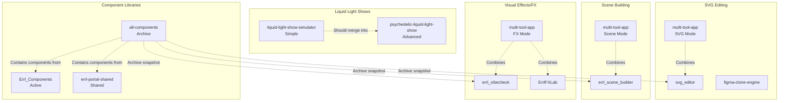
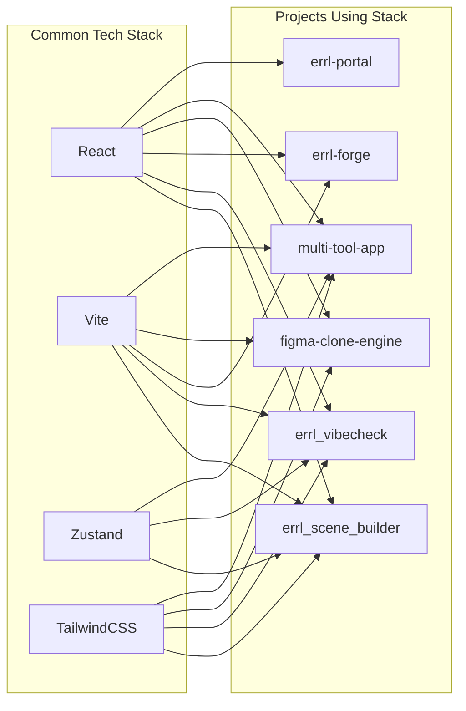
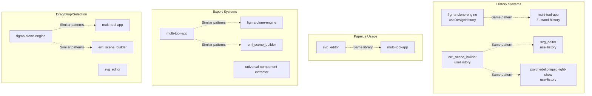
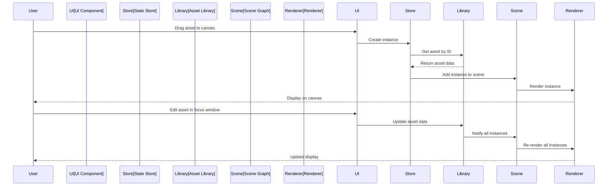
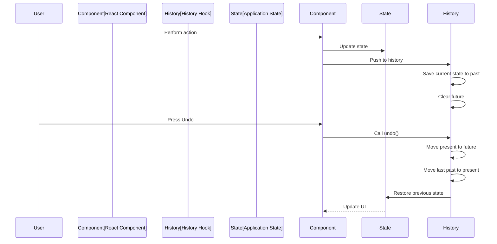
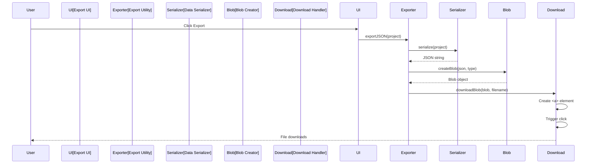

# Project Relationships

**Created:** 2027-01-07  
**Last Updated:** 2026-01-09  
**Purpose:** Visual documentation of project relationships, dependencies, and component flow

---

## Overview

This document maps the relationships between projects, showing:
- Which projects share functionality
- Dependency relationships
- Component flow (which projects use components from others)
- Data flow patterns
- Consolidation opportunities

---

## Functional Overlap Map



---

## Dependency Relationships



---

## Code Duplication Map



---

## Component Flow

```mermaid
graph TB
    subgraph Sources["Component Sources"]
        CV[component-vault<br/>Live library system<br/>Database-backed] ⚠️ NEW
        EC[Errl_Components<br/>13 components]
        EPS[errl-portal-shared<br/>Various]
        ECL[errl-club-ui<br/>50+ components]
        FCE_C[figma-clone-engine<br/>41 components]
        ESB_C[errl_scene_builder<br/>24 components]
        VC_C[errl_vibecheck<br/>11 components]
        EF_C[errl-forge<br/>12 components]
    end
    
    subgraph Tools["Component Tools"]
        UCE[universal-component-extractor<br/>Desktop extraction tool]
    end
    
    subgraph Archive["Archive"]
        AC[all-components<br/>199 components total<br/>Snapshot: Dec 22, 2024]
    end
    
    subgraph Consumers["Component Consumers"]
        EP[errl-portal]
        MTA[multi-tool-app]
        AC_PREVIEW[all-components/preview<br/>Component viewer]
    end
    
    CV -.->|"Extracts from"| Web[Websites via crawling]
    UCE -.->|"Extracts from"| Files[Uploaded files]
    
    EC --> AC
    EPS --> AC
    ECL --> AC
    FCE_C --> AC
    ESB_C --> AC
    VC_C --> AC
    EF_C --> AC
    
    EPS --> EP
    EC --> MTA
    AC --> AC_PREVIEW
    
    CV -.->|"Different use case"| UCE
```

---

## Design System Relationships

```mermaid
graph TB
    subgraph Sources["Design System Sources"]
        EC_DS[errl-club<br/>Original source]
        TL[theme-lab<br/>25 themes<br/>Playground tool] ⚠️ NEW
    end
    
    subgraph Current["Current Design Systems"]
        SD[shared/design-system<br/>Vanilla JS/CSS]
        AC_DS[all-components/errl-design-system<br/>React-focused]
    end
    
    subgraph Future["Future"]
        UNIFIED[shared/design-system<br/>Unified React-focused<br/>+ 25 themes from theme-lab] ⚠️ ENHANCED
    end
    
    subgraph Consumers["Consumers"]
        ESB[errl_scene_builder]
        VC[errl_vibecheck]
        MTA[multi-tool-app]
        FCE[figma-clone-engine]
        TL_TOOL[theme-lab<br/>Testing tool] ⚠️ NEW
    end
    
    EC_DS --> SD
    EC_DS --> AC_DS
    TL -.->|"Extract 25 themes"| UNIFIED ⚠️ NEW
    
    SD -.->|"Consolidate"| UNIFIED
    AC_DS -.->|"Consolidate"| UNIFIED
    
    UNIFIED --> ESB
    UNIFIED --> VC
    UNIFIED --> MTA
    UNIFIED --> FCE
    UNIFIED -.->|"Can use for testing"| TL_TOOL ⚠️ NEW
    TL_TOOL -.->|"Tests themes"| UNIFIED ⚠️ NEW
```

---

## Project Combination Map

```mermaid
graph TB
    subgraph Standalone["Standalone Projects"]
        SE[svg_editor<br/>25+ SVG tools]
        ESB[errl_scene_builder<br/>Scene synthesis]
        VC[errl_vibecheck<br/>AI visual coding]
        EFL[ErrlFXLab<br/>Creative coding]
    end
    
    subgraph NewProjects["New Projects"] ⚠️ NEW
        CV[component-vault<br/>Live component library]
        TL[theme-lab<br/>Design system playground]
        AIG[ai-studio-gallery<br/>27 HTML demos]
        CRG[components-ready-gallery<br/>40+ HTML components]
    end
    
    subgraph Combined["Combined Projects"]
        MTA[multi-tool-app<br/>Unified Creative Suite]
        EP[errl-portal<br/>Portal/Launcher?]
    end
    
    subgraph Archive["Archive"]
        AC[all-components<br/>Component archive]
    end
    
    subgraph Duplicates["Duplicates to Remove"] ⚠️ NEW
        EF_ASG[errl-forge/ai-studio-gallery]
        EF_CRG[errl-forge/components-ready-gallery]
        EF_CV[errl-forge/component-vault]
        EF_TL[errl-forge/theme-lab]
    end
    
    SE -.->|"SVG editing"| MTA
    ESB -.->|"Scene building"| MTA
    VC -.->|"FX/Vibes"| MTA
    EFL -.->|"FX/Vibes"| MTA
    
    SE --> AC
    ESB --> AC
    VC --> AC
    EFL --> AC
    
    EP -.->|"Uses components from"| AC
    EP -.->|"Uses components from"| EPS[errl-portal-shared]
    
    AIG -.->|"Similar structure"| CRG
    CRG -.->|"Similar structure"| AIG
    
    CV -.->|"Live library"| AC
    TL -.->|"25 themes for"| UNIFIED[shared/design-system]
    
    EF_ASG -.->|"Duplicate"| AIG
    EF_CRG -.->|"Duplicate"| CRG
    EF_CV -.->|"Duplicate"| CV
    EF_TL -.->|"Duplicate"| TL
```

---

## Data Flow Patterns

### Scene Graph Data Flow



### History/Undo-Redo Flow



### Export Flow



---

## Consolidation Opportunities

### High Priority

1. **Remove Duplicates** ⚠️ NEW
   - 4 duplicate projects in `errl-forge---asset-remixer/`:
     - ai-studio-gallery (duplicate)
     - components-ready-gallery (duplicate)
     - component-vault (duplicate)
     - theme-lab (duplicate/empty)
   - Action: Remove or archive duplicates

2. **Design Systems** (2 → 1) + Integrate theme-lab Themes ⚠️ ENHANCED
   - `shared/design-system` + `all-components/errl-design-system`
   - Merge into unified React-focused system
   - Integrate `theme-lab`'s 25 themes into unified design system

3. **History Hooks** (5+ → 1) ✅ COMPLETE
   - ✅ All projects using history → `shared/hooks/useHistory.ts`
   - Status: Complete

4. **Liquid Light Shows** (2 → 1) ✅ COMPLETE
   - ✅ `liquid-light-show-simulator` → archived
   - ✅ `psychedelic-liquid-light-show` is primary
   - Status: Complete

### Medium Priority

5. **Gallery Infrastructure** ⚠️ NEW (2 galleries → shared)
   - `ai-studio-gallery` + `components-ready-gallery` → `shared/templates/gallery/`
   - Create shared gallery template, utilities, and thumbnail generator
   - Keep galleries separate but share infrastructure

6. **Paper.js Utilities** (2 → shared) ✅ COMPLETE
   - ✅ `svg_editor` + `multi-tool-app` → `shared/utils/paper/`
   - Status: Complete

7. **Export Utilities** (4+ → shared) ✅ COMPLETE
   - ✅ Multiple projects → `shared/utils/export/`
   - ✅ Migrated: figma-clone-engine, errl_scene_builder
   - Status: Complete

8. **Interaction Utilities** (4+ → shared) ✅ COMPLETE
   - ✅ Drag/drop/selection → `shared/utils/interaction/`
   - Status: Utilities created, projects can migrate incrementally

### Low Priority

9. **Keyboard Shortcuts** (4+ → shared) ✅ COMPLETE
   - ✅ Multiple projects → `shared/hooks/useKeyboardShortcuts.ts`
   - ✅ Migrated: errl_scene_builder
   - Status: Utilities available, projects can migrate incrementally

10. **Scene Graph Utilities** (3+ → shared) ✅ COMPLETE
    - ✅ Scene management → `shared/utils/scene/`
    - Status: Utilities created, projects can migrate incrementally

11. **Component Analysis Patterns** ⚠️ NEW (Optional)
    - `component-vault` + `universal-component-extractor` → analyze for shared patterns
    - May not be compatible due to different approaches
    - Priority: Low (optional)

---

## Project Timeline (Estimated)

Based on file dates and dependencies:

1. **Early Projects:**
   - `ErrlFXLab` - Creative coding foundation
   - `svg_editor` - SVG editing tools
   - `errl_scene_builder` - Scene building

2. **Component Libraries:**
   - `Errl_Components` - React/Three.js components
   - `all-components` - Archive created Dec 22, 2024

3. **Combined Projects:**
   - `multi-tool-app` - Combines SVG, FX, Scene
   - `errl-portal` - Portal/launcher

4. **Specialized Projects:**
   - `figma-clone-engine` - Design tool
   - `errl_vibecheck` - AI visual coding
   - `errl-forge---asset-remixer` - Asset generation

5. **3D Projects:**
   - `errl-club` - 3D nightclub
   - `errl-galaxy` - Galaxy visualization
   - `errl-fluid` - Fluid simulation

---

## Gallery Projects Relationships ⚠️ NEW

```mermaid
graph TB
    subgraph Galleries["Static HTML Galleries"]
        AIG[ai-studio-gallery<br/>27 HTML demos]
        CRG[components-ready-gallery<br/>40+ HTML components]
    end
    
    subgraph SharedInfra["Shared Infrastructure"] ⚠️ FUTURE
        GALLERY_TEMPLATE[shared/templates/gallery/<br/>Gallery template]
        THUMB_GEN[shared/utils/gallery/thumbgen<br/>Thumbnail generator]
        GALLERY_JS[shared/utils/gallery/gallery.js<br/>Search/filter utilities]
        GALLERY_CSS[shared/utils/gallery/gallery.css<br/>Shared styling]
    end
    
    subgraph Related["Related Projects"]
        EP_GALLERY[errl-portal/gallery<br/>Portal gallery pages]
        AC_PREVIEW[all-components/preview<br/>Component preview]
    end
    
    AIG -.->|"Similar structure"| CRG
    CRG -.->|"Similar structure"| AIG
    
    AIG -.->|"Use shared template"| GALLERY_TEMPLATE ⚠️ FUTURE
    CRG -.->|"Use shared template"| GALLERY_TEMPLATE ⚠️ FUTURE
    
    AIG --> THUMB_GEN
    CRG -.->|"Can use"| THUMB_GEN ⚠️ FUTURE
    
    EP_GALLERY -.->|"Similar concept"| AIG
    EP_GALLERY -.->|"Similar concept"| CRG
    AC_PREVIEW -.->|"Similar concept"| AIG
    AC_PREVIEW -.->|"Similar concept"| CRG
```

## Component Extraction Tools Relationships ⚠️ NEW

```mermaid
graph TB
    subgraph ExtractionTools["Component Extraction Tools"]
        CV[component-vault<br/>Web-based<br/>Database-backed<br/>Automated crawling]
        UCE[universal-component-extractor<br/>Desktop app<br/>File upload<br/>Multiple AI providers]
    end
    
    subgraph ComponentLibraries["Component Libraries"]
        AC[all-components<br/>Archive]
        EC[Errl_Components<br/>Active 3D library]
        EPS[errl-portal-shared<br/>Active portal library]
    end
    
    subgraph SharedUtils["Shared Utilities"]
        EXPORT[shared/utils/export/<br/>Export utilities] ✅
        AI_PATTERNS[shared/utils/ai/<br/>AI patterns] ⚠️ FUTURE
    end
    
    CV -.->|"Extracts to"| PostgreSQL[(PostgreSQL Database)]
    CV -.->|"Generates"| React[React Components]
    CV -.->|"Uses"| EXPORT
    
    UCE -.->|"Extracts from"| Files[Uploaded Files]
    UCE -.->|"Generates"| React
    UCE -.->|"Uses"| EXPORT
    
    CV -.->|"Different use case"| UCE
    UCE -.->|"Different use case"| CV
    
    CV -.->|"Live library"| AC
    CV -.->|"Complements"| EC
    CV -.->|"Complements"| EPS
```

## Design System & Theme Relationships ⚠️ UPDATED

```mermaid
graph TB
    subgraph ThemeSources["Theme Sources"]
        EC_DS[errl-club<br/>Original design system]
        TL[theme-lab<br/>25 themes<br/>Playground tool] ⚠️ NEW
    end
    
    subgraph CurrentDS["Current Design Systems"]
        SD[shared/design-system<br/>Vanilla JS/CSS]
        AC_DS[all-components/errl-design-system<br/>React-focused]
    end
    
    subgraph FutureDS["Future Unified Design System"]
        UNIFIED[shared/design-system<br/>Unified React-focused<br/>+ 25 themes from theme-lab] ⚠️ ENHANCED
    end
    
    subgraph Consumers["Consumers"]
        ESB[errl_scene_builder]
        VC[errl_vibecheck]
        MTA[multi-tool-app]
        FCE[figma-clone-engine]
        TL_TOOL[theme-lab<br/>Testing tool] ⚠️ NEW
    end
    
    EC_DS --> SD
    EC_DS --> AC_DS
    TL -.->|"Extract 25 themes"| UNIFIED ⚠️ NEW
    
    SD -.->|"Consolidate"| UNIFIED
    AC_DS -.->|"Consolidate"| UNIFIED
    
    UNIFIED --> ESB
    UNIFIED --> VC
    UNIFIED --> MTA
    UNIFIED --> FCE
    UNIFIED -.->|"Can use for testing"| TL_TOOL ⚠️ NEW
    TL_TOOL -.->|"Tests themes"| UNIFIED ⚠️ NEW
```

## Key Relationships Summary

### Explicit Combinations
- **`multi-tool-app`** = SVG editing + FX Lab + Scene Maker
  - Intentionally combines functionality from multiple projects
  - Documented in PRD

### Duplications to Consolidate ⚠️ UPDATED
- **History systems** - 5+ projects with similar implementations ✅ COMPLETE
- **Design systems** - 2 systems that should be one (in progress) + integrate theme-lab's 25 themes ⚠️ ENHANCED
- **Liquid light shows** - 2 projects, one is more advanced ✅ COMPLETE
- **Duplicates in errl-forge** - 4 duplicate projects need removal ⚠️ NEW

### Component Libraries & Tools ⚠️ UPDATED
- **`component-vault`** ⚠️ NEW - Live web-based component library system (database-backed)
  - Purpose: Automated web crawling, component extraction, database storage
  - Relationship: Complement to all-components archive, complement to universal-component-extractor tool
- **`all-components`** - Archive of 199 components from 9 projects
  - Not a live library, snapshot from Dec 22, 2024
  - Used for reference/preview
- **`Errl_Components`** - Active 3D component library (source of truth)
- **`errl-portal-shared`** - Active portal component library (source of truth)
- **`universal-component-extractor`** - Desktop component extraction tool (complement to component-vault)

### Static HTML Galleries ⚠️ NEW
- **`ai-studio-gallery`** - 27 HTML demos with AI-generated visual effects
- **`components-ready-gallery`** - 40+ HTML components with ready-to-use visual effects
- **Relationship:** Similar structure, could share infrastructure
- **Related:** errl-portal gallery pages, all-components preview

### Design System Tools ⚠️ NEW
- **`theme-lab`** - Design system playground with 25 themes
  - Purpose: Testing/previewing themes
  - Relationship: 25 themes should be integrated into unified design system
  - Keep as separate tool but integrate themes

### Shared Dependencies
- **React + Vite + Zustand + TailwindCSS** - 6+ projects
- **Three.js** - 5 projects
- **Paper.js** - 2 projects (✅ consolidated to shared/utils/paper/)
- **Google Gemini AI** - 3 projects (component-vault uses OpenAI) ⚠️ UPDATED
- **OpenAI** - 2 projects (component-vault, universal-component-extractor) ⚠️ NEW

---

## Next Steps

1. Review relationship maps
2. Prioritize consolidations
3. Begin migrations
4. Update this document as relationships change

---

## References

- [Project Similarity Analysis](PROJECT_SIMILARITY_ANALYSIS.md) - Detailed findings
- [Consolidation Strategy](CONSOLIDATION_STRATEGY.md) - Strategic approach
- [Consolidation Roadmap](CONSOLIDATION_ROADMAP.md) - Implementation timeline
- [Code Patterns](CODE_PATTERNS.md) - Common patterns documentation
