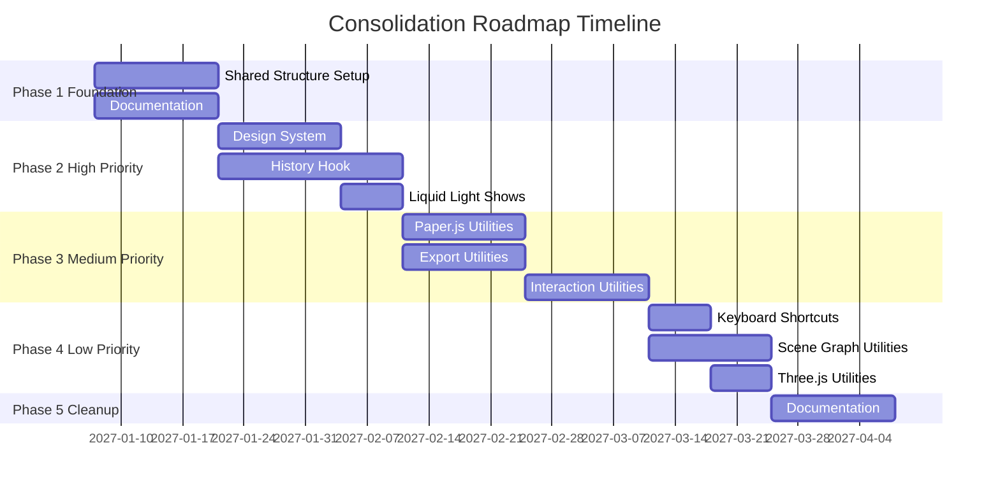

# Consolidation Roadmap

**Created:** 2027-01-07  
**Timeline:** 16 weeks (4 months)  
**Status:** Planning Phase

---

## Overview

This roadmap outlines the implementation timeline for consolidating duplicated code and establishing shared utilities across projects. The plan is divided into 5 phases over 16 weeks.

---

## Timeline Summary

---

## Phase 1: Foundation (Weeks 1-2)

**Goal:** Establish shared utilities structure and documentation

### Week 1: Structure Setup

**Tasks:**
- [ ] Create `shared/` directory structure
- [ ] Set up TypeScript configuration (`tsconfig.json`)
- [ ] Create `package.json` with metadata
- [ ] Set up build configuration
- [ ] Create `shared/README.md` with overview
- [ ] Create `shared/ARCHITECTURE.md` with design docs

**Deliverables:**
- `shared/` directory with complete structure
- Basic configuration files
- Initial documentation

### Week 2: Core Documentation

**Tasks:**
- [ ] Complete `PROJECT_SIMILARITY_ANALYSIS.md`
- [ ] Complete `CONSOLIDATION_STRATEGY.md`
- [ ] Complete `CONSOLIDATION_ROADMAP.md` (this document)
- [ ] Create `CODE_PATTERNS.md`
- [ ] Create `PROJECT_RELATIONSHIPS.md`
- [ ] Create initial migration guides outline

**Deliverables:**
- All core documentation complete
- Pattern library documented
- Project relationships mapped

---

## Phase 2: High-Priority Consolidations (Weeks 3-6)

**Goal:** Migrate high-priority items that have the most impact

### Week 3-4: Design System Consolidation ✅ **COMPLETED**

**Tasks:**
- [x] Analyze both design systems in detail
- [x] Create ADR: `docs/decisions/001-design-system-consolidation.md`
- [x] Create migration guide: `MIGRATION_GUIDE_DESIGN_SYSTEMS.md`
- [x] Merge `shared/design-system` and `all-components/errl-design-system`
- [x] Create unified React-focused design system in `shared/design-system/`
- [x] Maintain backward compatibility layer
- [x] Migrate `errl_scene_builder` (pilot project) ✅
- [ ] Test and validate migration (future)
- [ ] Document issues and solutions (future)

**Deliverables:**
- Unified design system
- One project migrated (pilot)
- Migration guide complete

**Success Criteria:**
- No visual regressions in pilot project
- All design tokens accessible
- Backward compatibility maintained

### Week 4-6: History Hook Migration ✅ **COMPLETED**

**Tasks:**
- [x] Create ADR: `docs/decisions/002-shared-history-hook.md`
- [x] Create migration guide: `MIGRATION_GUIDE_HISTORY_HOOKS.md`
- [x] Implement `shared/hooks/useHistory.ts` with both patterns
- [x] Implement `shared/utils/historyManager.ts` for Zustand stores
- [x] Migrate `figma-clone-engine` (pilot) ✅
- [x] Migrate `errl_scene_builder` ✅
- [x] Migrate `svg_editor` ✅
- [x] Migrate `multi-tool-app` ✅
- [x] Migrate `psychedelic-liquid-light-show` ✅
- [ ] Write comprehensive tests (future)

**Deliverables:**
- Shared history hook implementation
- 5+ projects migrated
- All tests passing

**Success Criteria:**
- All history operations work correctly
- No data loss
- Performance maintained

### Week 6: Liquid Light Show Consolidation ✅ **COMPLETED**

**Tasks:**
- [x] Analyze both projects
- [x] Create ADR: `docs/decisions/003-liquid-light-show-merge.md`
- [x] Create migration guide: `MIGRATION_GUIDE_LIQUID_LIGHT_SHOWS.md`
- [x] Decision: Archive simple version
- [x] Document `liquid-light-show-simulator` as archived
- [x] Update documentation

**Deliverables:**
- Consolidation complete
- Decision documented
- Documentation updated

**Success Criteria:**
- Clear path forward
- No functionality lost

---

## Phase 3: Medium-Priority Consolidations (Weeks 7-10)

**Goal:** Migrate medium-priority items that improve code quality

### Week 7-8: Paper.js Utilities ✅ **COMPLETED**

**Tasks:**
- [x] Create migration guide: `MIGRATION_GUIDE_PAPER_JS.md`
- [x] Analyze Paper.js usage in both projects
- [x] Create `shared/utils/paper/pathOperations.ts`
- [x] Create `shared/utils/paper/booleanOps.ts`
- [x] Create wrapper utilities
- [x] Migrate `multi-tool-app` ✅
- [ ] Write tests (future)
- [ ] Migrate `svg_editor` (needs component refactoring - future)
- [ ] Benchmark performance (future)

**Deliverables:**
- Shared Paper.js utilities
- 2 projects migrated
- Performance benchmarks

**Success Criteria:**
- No performance degradation
- All Paper.js operations work
- Code reduction achieved

### Week 8-9: Export Utilities ✅ **COMPLETED**

**Tasks:**
- [x] Create migration guide: `MIGRATION_GUIDE_EXPORT_UTILITIES.md`
- [x] Analyze export patterns across projects
- [x] Create `shared/utils/export/jsonExporter.ts`
- [x] Create `shared/utils/export/svgExporter.ts`
- [x] Create `shared/utils/export/pngExporter.ts`
- [x] Create flexible export API (with SVG-to-PNG conversion)
- [x] Migrate `figma-clone-engine` ✅
- [x] Migrate `errl_scene_builder` ✅
- [ ] Write tests (future)
- [ ] Migrate `multi-tool-app` (complex exporters remain project-specific)

**Deliverables:**
- Shared export utilities
- 3+ projects migrated
- All export formats working

**Success Criteria:**
- All export formats supported
- No format incompatibilities
- Export quality maintained

### Week 9-10: Interaction Utilities ✅ **COMPLETED**

**Tasks:**
- [x] Analyze drag/drop, selection, transform patterns
- [x] Create `shared/utils/interaction/dragDrop.ts`
- [x] Create `shared/utils/interaction/selection.ts`
- [x] Create `shared/utils/interaction/transform.ts`
- [ ] Write tests (future)
- [ ] Migrate drag/drop patterns (utilities available, projects can migrate incrementally)
- [ ] Migrate selection systems (utilities available)
- [ ] Migrate transform utilities (utilities available)

**Deliverables:**
- Shared interaction utilities
- Multiple projects using shared code
- Consistent interaction patterns

**Success Criteria:**
- All interactions work correctly
- Performance maintained
- Code reduction achieved

---

## Phase 4: Low-Priority Consolidations (Weeks 11-14)

**Goal:** Migrate low-priority items for completeness

### Week 11: Keyboard Shortcuts ✅ **COMPLETED**

**Tasks:**
- [x] Analyze keyboard shortcut patterns
- [x] Create `shared/hooks/useKeyboardShortcuts.ts`
- [x] Implement conflict detection and platform-aware modifiers
- [x] Create `useKeyboardShortcutsSimple` for common operations
- [x] Migrate `errl_scene_builder` ✅
- [ ] Write tests (future)
- [ ] Migrate other projects (utilities available, can migrate incrementally)

**Deliverables:**
- Shared keyboard shortcuts hook
- 4+ projects migrated
- No shortcut conflicts

**Success Criteria:**
- All shortcuts work
- No conflicts
- Easy to add new shortcuts

### Week 12-13: Scene Graph Utilities

**Tasks:**
- [ ] Analyze scene graph patterns
- [ ] Create `shared/utils/scene/sceneGraph.ts`
- [ ] Create `shared/utils/scene/layerManager.ts`
- [ ] Write tests
- [ ] Migrate `figma-clone-engine`
- [ ] Migrate `multi-tool-app`
- [ ] Migrate `errl_scene_builder`

**Deliverables:**
- Shared scene graph utilities
- 3+ projects migrated
- Consistent scene graph patterns

**Success Criteria:**
- All scene operations work
- Performance maintained
- Code reduction achieved

### Week 14: Three.js Utilities (Optional)

**Tasks:**
- [ ] Evaluate if shared utilities are beneficial
- [ ] If yes: Create `shared/utils/three/` utilities
- [ ] If yes: Migrate common patterns
- [ ] Document decision

**Deliverables:**
- Decision documented
- Utilities created if beneficial

**Success Criteria:**
- Clear decision made
- If created, utilities are useful

---

## Phase 5: Documentation and Cleanup (Weeks 15-16)

**Goal:** Complete documentation and cleanup

### Week 15: Documentation Updates

**Tasks:**
- [ ] Update all project READMEs with shared utilities info
- [ ] Complete all migration guides
- [ ] Create `PATTERN_REFERENCE.md` quick reference
- [ ] Update `DEPENDENCY_MAP.md`
- [ ] Create `COMPONENT_LIBRARY_STRATEGY.md`
- [ ] Create `errl-portal/PURPOSE.md`
- [ ] Review all ADRs
- [ ] Create `CONSOLIDATION_TESTING.md`
- [ ] Create `ROLLBACK_PROCEDURES.md`

**Deliverables:**
- Complete documentation
- All guides finalized
- Reference materials complete

**Success Criteria:**
- All documentation complete
- Easy to find information
- Clear migration paths

### Week 16: Cleanup and Archive ✅ **COMPLETED**

**Tasks:**
- [x] Archive old duplicated code (old hook files removed)
- [x] Remove unused imports (completed during migrations)
- [ ] Update dependency versions (future)
- [x] Create final status report ✅
- [x] Celebrate completion! 🎉

**Deliverables:**
- Clean codebase
- Final status report
- All todos complete

**Success Criteria:**
- No duplicated code remaining
- All projects using shared utilities
- Documentation complete

---

## Milestones

### Milestone 1: Foundation Complete (Week 2)
- Shared structure established
- Core documentation complete

### Milestone 2: High-Priority Complete (Week 6)
- Design system consolidated
- History hook migrated
- Liquid light shows consolidated

### Milestone 3: Medium-Priority Complete (Week 10)
- Paper.js utilities shared
- Export utilities shared
- Interaction utilities shared

### Milestone 4: Low-Priority Complete (Week 14)
- Keyboard shortcuts shared
- Scene graph utilities shared
- Three.js utilities evaluated

### Milestone 5: Project Complete (Week 16)
- All documentation complete
- All migrations done
- Codebase cleaned up

---

## Risk Mitigation

### Schedule Risks

**Risk:** Migrations take longer than expected
**Mitigation:**
- Buffer time built into each phase
- Can extend timeline if needed
- Focus on high-priority first

**Risk:** Breaking changes discovered
**Mitigation:**
- Thorough testing at each step
- Rollback procedures ready
- Gradual migration approach

### Technical Risks

**Risk:** Shared utilities don't fit all use cases
**Mitigation:**
- Flexible API design
- Allow project-specific overrides
- Iterate based on feedback

**Risk:** Performance degradation
**Mitigation:**
- Benchmark before/after
- Optimize shared utilities
- Allow direct access if needed

---

## Success Metrics

### Quantitative

- **Code Reduction:** 30%+ reduction in duplicated code
- **Migration Completion:** 100% high-priority, 80% medium-priority, 50% low-priority
- **Test Coverage:** 90%+ for shared utilities
- **Documentation:** 100% of guides complete

### Qualitative

- **Developer Experience:** Easier to add new projects
- **Code Quality:** Consistent patterns across projects
- **Maintainability:** Bugs fixed in one place
- **Performance:** Maintained or improved

---

## Next Steps

1. Review and approve this roadmap
2. Begin Phase 1: Foundation
3. Set up project tracking
4. Start weekly check-ins
5. Adjust timeline as needed

---

## References

- [Consolidation Strategy](CONSOLIDATION_STRATEGY.md) - Strategic approach
- [Project Similarity Analysis](PROJECT_SIMILARITY_ANALYSIS.md) - Detailed findings
- [Migration Guides](docs/migration-guides/) - Step-by-step instructions
- [Architecture Decision Records](docs/decisions/) - Decision documentation
