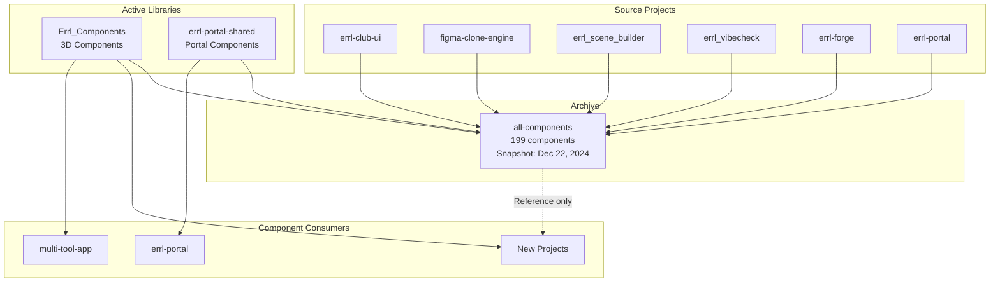

# Component Library Strategy

**Created:** 2027-01-07  
**Last Updated:** 2026-01-09  
**Purpose:** Clarify the purpose and relationships between component library collections and tools

---

## Overview

This document establishes the strategy for component library collections and tools found in the workspace:
1. `Errl_Components` - Active React/Three.js component library
2. `all-components` - Archive of components from multiple projects
3. `errl-portal-shared` - Shared components for errl-portal
4. `component-vault` ⚠️ NEW - Live web-based component library system (database-backed)
5. `universal-component-extractor` - Desktop component extraction tool

---

## Current State

### `Errl_Components` - Active 3D Component Library

**Location:** [`Errl_Components/`](Errl_Components/)

**Purpose:** Source of truth for React/Three.js 3D components

**Contents:**
- 13 components (BubbleButton, BubbleMesh, ErrlContentLayout, TrippyScene, etc.)
- Shaders and stores
- React + Three.js integration

**Status:** ✅ **Active Development**

**Usage:**
```tsx
import { BubbleButton, TrippyScene } from '@/Errl_Components';

function MyComponent() {
  return (
    <TrippyScene>
      <BubbleButton>Click me</BubbleButton>
    </TrippyScene>
  );
}
```

**Guidelines:**
- Use for 3D/Three.js components
- Source of truth for Errl 3D components
- Continue active development
- Add new 3D components here

---

### `all-components` - Component Archive

**Location:** [`all-components/`](all-components/)

**Purpose:** Archive/reference collection of components from multiple projects

**Contents:**
- 199 component files total
- Components from 9 projects (snapshot from December 22, 2024):
  - `errl-club-ui` (50+ components)
  - `figma-clone-engine` (41 components)
  - `errl_scene_builder` (24 components)
  - `errl_vibecheck` (11 components)
  - `errl-forge` (12 components)
  - `Errl_Components` (13 components)
  - `errl-portal` (5 components)
  - `errl-portal-shared` (various)

**Status:** 📦 **Archive (Not Active Library)**

**Usage:**
- ✅ Reference for examples/inspiration
- ✅ Component catalog/preview
- ❌ **DO NOT** import directly in new projects
- ❌ **DO NOT** use as source of truth

**Guidelines:**
- Use for reference only
- For active components, use source project
- Archive snapshot - not updated
- Component preview/catalog available

---

### `errl-portal-shared` - Portal Shared Components

**Location:** [`all-components/errl-portal-shared/`](all-components/errl-portal-shared/)

**Purpose:** Shared components and utilities specifically for `errl-portal`

**Contents:**
- Component library catalog
- Project components (bubble-mouse-trail, gravity-sticker-field, etc.)
- SVG utilities
- UI components

**Status:** ✅ **Active (Used by errl-portal)**

**Usage:**
```tsx
// For errl-portal project only
import { GravityStickerField } from '@/all-components/errl-portal-shared/projects/gravity-sticker-field';
```

**Guidelines:**
- Use for portal-specific components
- Source of truth for portal shared code
- Used by `errl-portal` project
- Portal-specific utilities

---

### `component-vault` - Live Component Library System ⚠️ NEW

**Location:** [`component-vault/`](component-vault/)

**Purpose:** Live web-based component library system (database-backed)

**Contents:**
- Web-based component archiver/library system
- Crawls websites and extracts UI components
- Stores components in PostgreSQL database
- Uses AI (OpenAI) for component analysis and React conversion
- Searchable component library with favorites and tagging

**Tech Stack:**
- Next.js 14 (App Router)
- Prisma (PostgreSQL database)
- Redis + BullMQ (Job queue)
- Playwright (Web crawling)
- OpenAI (Component analysis)

**Status:** ✅ **Active (Live Library System)**

**Usage:**
- Automated web crawling and component extraction
- Component library building from websites
- AI-powered component analysis
- React code generation from HTML
- Searchable component database

**Use Case:**
- Crawl websites and extract components
- Build component library from web sources
- Automated component discovery and analysis
- Database-backed component storage

**Guidelines:**
- Use for web-based component library system
- Different from all-components archive (live vs archive)
- Different from universal-component-extractor (automated vs manual, web vs desktop)
- Complement to all-components archive

---

### `universal-component-extractor` - Desktop Component Extraction Tool

**Location:** [`universal-component-extractor/`](universal-component-extractor/)

**Purpose:** Desktop app for extracting and reverse-engineering web components from files

**Contents:**
- Desktop application (Electron)
- Extracts components from uploaded files (HTML, React, Three.js, JSON)
- Supports multiple AI providers (Gemini, OpenAI, Anthropic, Ollama)
- Multiple export formats (HTML, TSX, JS, SCSS, ZIP)

**Status:** ✅ **Active (Desktop Tool)**

**Usage:**
- Manual component extraction from files
- Reverse engineering web components
- Component cleaning and conversion
- Framework-agnostic component extraction

**Use Case:**
- Extract components from uploaded files
- Reverse engineer existing components
- Clean and convert components
- Desktop-based component extraction

**Guidelines:**
- Use for manual component extraction from files
- Different from component-vault (manual vs automated, desktop vs web)
- Complement to component-vault (different use cases)
- Supports multiple AI providers for flexibility

---

## Strategy Decision

### Primary Component Libraries

1. **`Errl_Components`** - For 3D/Three.js components
   - Source of truth for React/Three.js components
   - Continue active development
   - Add new 3D components here

2. **`errl-portal-shared`** - For portal-specific components
   - Source of truth for portal components
   - Used by `errl-portal` project
   - Portal-specific utilities

3. **`component-vault`** ⚠️ NEW - For web-based component library system
   - Live component library system (database-backed)
   - Automated web crawling and component extraction
   - AI-powered component analysis
   - Searchable component database

### Component Extraction Tools

4. **`universal-component-extractor`** - Desktop component extraction tool
   - Manual component extraction from files
   - Multiple AI providers supported
   - Desktop-based workflow

### Archive

5. **`all-components`** - Archive/reference only
   - Not a live library
   - Use for reference/examples
   - Do not import directly
   - Component catalog available
   - Snapshot from December 22, 2024

---

## Component Sharing Strategy

### For New Projects

**3D Components:**
- Use `Errl_Components` for React/Three.js components
- Import directly from `Errl_Components/`

**Portal Components:**
- Use `errl-portal-shared` for portal-specific components
- Only if building portal-related features

**Web UI Components (From Websites):**
- Use `component-vault` to crawl websites and extract components
- Build component library from web sources
- Database-backed component storage

**Component Extraction (From Files):**
- Use `universal-component-extractor` to extract components from uploaded files
- Manual component extraction and reverse engineering
- Desktop-based workflow

**Other Components:**
- Create project-specific components when needed
- Reference `all-components` for examples/inspiration
- Extract to shared libraries if used by 3+ projects

### For Existing Projects

**Continue Current Approach:**
- Projects can continue using current component sources
- No forced migration required
- Migrate to shared utilities when beneficial

**When to Extract:**
- Component used by 3+ projects
- Component is truly generic
- Maintenance burden is high
- Follows shared utilities guidelines

---

## Migration Path for `all-components`

### Current Status: Archive

**Decision:** Keep as archive, do not activate as live library

**Reasoning:**
1. Snapshot from December 22, 2024
2. Components are copies, not source
3. Source projects are the source of truth
4. Archive serves as reference/catalog

### Archive Documentation

**Update `all-components/README.md`:**
```markdown
# All Components Collection - ARCHIVE

⚠️ **This is an archive, not a live library.**

This directory contains components copied from various projects as a snapshot
from December 22, 2024. 

**Do not import directly from this archive.**

For active components:
- 3D components: Use `Errl_Components/`
- Portal components: Use `errl-portal-shared/`
- Other components: Use source project or create new

This archive is for reference and component catalog viewing only.
```

### Component Catalog

**Purpose:**
- Preview components from multiple projects
- Reference for examples
- Inspiration for new components
- Component catalog viewer

**Location:** `all-components/preview/`

**Usage:**
- Browse components
- See examples
- Reference implementations
- Do not import directly

---

## Component Extraction Process

### When to Extract to Shared

**Extract when:**
- ✅ Component used by 3+ projects
- ✅ Component is truly generic
- ✅ Maintenance burden is high
- ✅ Follows shared utilities guidelines

**Do not extract when:**
- ❌ Component is project-specific
- ❌ Component has tight coupling
- ❌ Extraction adds complexity
- ❌ Only used by 1-2 projects

### Extraction Steps

1. **Identify candidate**
   - Component used by 3+ projects
   - Generic enough for reuse

2. **Choose destination**
   - `Errl_Components` for 3D components
   - `errl-portal-shared` for portal components
   - `shared/design-system/components/` for design system components
   - New shared location if needed

3. **Extract and generalize**
   - Remove project-specific code
   - Make it generic
   - Add TypeScript types
   - Write tests

4. **Update projects**
   - Migrate projects to use shared component
   - Update imports
   - Test thoroughly

5. **Document**
   - Update READMEs
   - Add usage examples
   - Document API

---

## Component Catalog Structure

### `all-components/preview/`

**Purpose:** Component catalog viewer

**Features:**
- Browse components from all projects
- Preview components
- See examples
- Reference implementations

**Usage:**
- Open `all-components/preview.html` or run preview app
- Browse by project
- View component examples
- Reference for inspiration

**Do not:**
- Import components directly
- Use as source of truth
- Expect updates

---

## Relationships



---

## Guidelines Summary

### ✅ Do

- Use `Errl_Components` for 3D components
- Use `errl-portal-shared` for portal components
- Reference `all-components` for examples
- Create project-specific components when needed
- Extract to shared when used by 3+ projects

### ❌ Don't

- Import directly from `all-components`
- Use `all-components` as source of truth
- Create duplicate component libraries
- Force migration if not beneficial

---

## Next Steps

1. Update `all-components/README.md` with archive notice
2. Update project READMEs with component usage guidelines
3. Document component extraction process
4. Create component catalog documentation

---

## References

- [Migration Guide: Component Libraries](docs/migration-guides/MIGRATION_GUIDE_COMPONENT_LIBRARIES.md)
- [Project Similarity Analysis](PROJECT_SIMILARITY_ANALYSIS.md)
- [Consolidation Strategy](CONSOLIDATION_STRATEGY.md)
