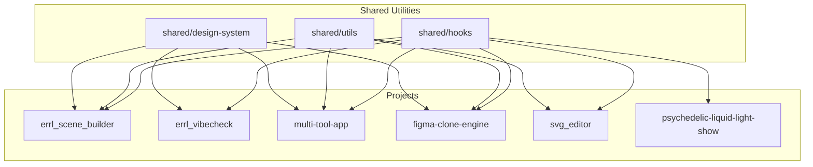

# Dependency Map

**Created:** 2027-01-07  
**Last Updated:** 2027-01-09  
**Purpose:** Track which projects depend on which shared utilities and dependencies

---

## Overview

This document tracks dependencies across projects, showing which projects use which shared utilities, design systems, and external dependencies.

---

## Shared Utilities Dependencies

### History Hook (`shared/hooks/useHistory.ts`)

**Projects Using:**
- `figma-clone-engine` ✅ (using via @/shared/* path alias)
- `multi-tool-app` ✅ (using via @/shared/* path alias, also uses HistoryManager)
- `svg_editor` ✅ (using via @/shared/* path alias)

**Projects Planned:**
- `errl_scene_builder` ⏳ (planned)
- `psychedelic-liquid-light-show` ⏳ (planned)

**Status:** Implementation complete, 3 projects actively using, 2 planned
**Issues:** TypeScript compilation errors due to missing React types in shared (requires npm install)

---

### Design System (`shared/design-system/`)

**Projects Using (After Migration):**
- `errl_scene_builder` ✅ (planned - pilot)
- `errl_vibecheck` ✅ (planned)
- `multi-tool-app` ✅ (planned)
- `figma-clone-engine` ✅ (planned)
- `errl-forge---asset-remixer` ✅ (planned)
- `errl-portal` ✅ (planned)

**Status:** Consolidation planned, migrations pending

---

### Paper.js Utilities (`shared/utils/paper/`)

**Projects Using:**
- `svg_editor` ✅ (using via @/shared/* path alias)
- `multi-tool-app` ✅ (using via @/shared/* path alias)

**Status:** Implementation complete, both projects actively using
**Issues:** TypeScript compilation errors due to missing Paper types (requires npm install in shared)

---

### Export Utilities (`shared/utils/export/`)

**Projects Using (After Migration):**
- `multi-tool-app` ✅ (planned)
- `figma-clone-engine` ✅ (planned)
- `errl_scene_builder` ✅ (planned)
- `universal-component-extractor` ✅ (planned)

**Status:** Implementation pending, migrations pending

---

## External Dependencies

### React + Vite + Zustand + TailwindCSS

**Projects Using:**
- `errl_scene_builder`
  - React: ^18.3.1
  - Vite: ^7.2.4
  - Zustand: ^4.5.2
  - TailwindCSS: ^4.1.17

- `errl_vibecheck`
  - React: ^19.2.1
  - Vite: ^6.2.0
  - Zustand: ^5.0.8
  - TailwindCSS: ^4.1.15

- `figma-clone-engine`
  - React: ^18.2.0
  - Vite: ^4.4.5
  - TailwindCSS: ^3.3.3

- `multi-tool-app`
  - React: ^18.3.1
  - Vite: ^7.2.4
  - Zustand: ^4.5.2
  - TailwindCSS: ^4.1.17

**Recommendation:** Standardize versions where possible

---

### Three.js / React Three Fiber

**Projects Using:**
- `errl-club`
  - three: (from package.json)
  - @supabase/supabase-js

- `errl-galaxy`
  - three: (from dependencies)
  - @react-three/fiber
  - @react-three/drei
  - lamina
  - zustand

- `errl-fluid`
  - three
  - @react-three/fiber
  - @react-three/drei
  - @react-three/cannon
  - @react-spring/three
  - framer-motion
  - leva
  - zustand

- `Errl_Components`
  - three
  - @react-three/fiber
  - @react-three/drei
  - zustand

- `psychedelic-liquid-light-show`
  - three
  - pixi.js

**Recommendation:** Consider shared Three.js utilities if beneficial

---

### Paper.js

**Projects Using:**
- `svg_editor`
  - paper: ^0.12.18

- `multi-tool-app`
  - paper: ^0.12.18

**Recommendation:** Extract to `shared/utils/paper/`

---

### Google Gemini AI

**Projects Using:**
- `errl_vibecheck`
  - @google/genai: ^1.22.0

- `errl-forge---asset-remixer`
  - @google/genai: (from dependencies)

- `psychedelic-liquid-light-show`
  - Google Gemini API (for color palettes)

**Recommendation:** Consider shared AI service utilities

---

### Lucide React Icons

**Projects Using:**
- `svg_editor`
- `multi-tool-app`
- `figma-clone-engine`
- `errl_scene_builder`
- `errl-forge---asset-remixer`
- `errl-portal`

**Recommendation:** Standardize icon usage patterns

---

## Dependency Versions

### React Versions

- **React 18:** `errl_scene_builder`, `figma-clone-engine`, `multi-tool-app`, `svg_editor`
- **React 19:** `errl_vibecheck`

**Recommendation:** Migrate to React 19 when stable, or standardize on React 18

### Vite Versions

- **Vite 4:** `figma-clone-engine` (^4.4.5)
- **Vite 6:** `errl_vibecheck` (^6.2.0)
- **Vite 7:** `errl_scene_builder`, `multi-tool-app` (^7.2.4)

**Recommendation:** Standardize on Vite 7 (latest)

### Zustand Versions

- **Zustand 4:** `errl_scene_builder`, `multi-tool-app` (^4.5.2)
- **Zustand 5:** `errl_vibecheck` (^5.0.8)

**Recommendation:** Standardize on Zustand 5 (latest)

### TailwindCSS Versions

- **TailwindCSS 3:** `figma-clone-engine` (^3.3.3)
- **TailwindCSS 4:** `errl_scene_builder`, `errl_vibecheck`, `multi-tool-app` (^4.1.x)

**Recommendation:** Migrate to TailwindCSS 4 (latest)

---

## Update Propagation Strategy

### Shared Utilities Updates

**Process:**
1. Update shared utility
2. Test thoroughly
3. Update version (if breaking change)
4. Notify projects using it
5. Projects update imports (if needed)
6. Test in each project

### Dependency Updates

**Process:**
1. Test update in one project
2. Verify no breaking changes
3. Update other projects
4. Test thoroughly
5. Document changes

---

## Dependency Graph

---

## Version Compatibility Matrix

| Project | React | Vite | Zustand | TailwindCSS | Status |
|---------|-------|------|---------|-------------|--------|
| errl_scene_builder | 18.3.1 | 7.2.4 | 4.5.2 | 4.1.17 | ✅ Current |
| errl_vibecheck | 19.2.1 | 6.2.0 | 5.0.8 | 4.1.15 | ✅ Current |
| multi-tool-app | 18.3.1 | 7.2.4 | 4.5.2 | 4.1.17 | ✅ Current |
| figma-clone-engine | 18.2.0 | 4.4.5 | - | 3.3.3 | ⚠️ Needs update |
| svg_editor | 18.2.0 | 5.0.8 | - | - | ✅ Current |

**Recommendation:** Standardize versions where possible

---

## Shared Utilities Version Tracking

### Current Versions

- `shared/hooks/useHistory.ts` - v1.0.0 (initial implementation)
- `shared/design-system/` - v1.0.0 (consolidation pending)
- `shared/utils/export/` - v1.0.0 (implementation pending)
- `shared/utils/paper/` - v1.0.0 (implementation pending)

### Version Policy

- **Major:** Breaking changes
- **Minor:** New features (backward compatible)
- **Patch:** Bug fixes

---

## Update Strategy

### Breaking Changes

1. **Major version bump**
2. **Migration guide required**
3. **Deprecation period (2 versions)**
4. **Projects update gradually**

### Non-Breaking Changes

1. **Minor/patch version bump**
2. **Projects can update immediately**
3. **No migration needed**

---

## Monitoring Dependencies

### Tools

- `npm outdated` - Check for updates
- Dependabot - Automated dependency updates
- Renovate - Automated dependency updates

### Process

1. **Regular checks** (monthly)
2. **Security updates** (immediate)
3. **Major updates** (planned)
4. **Test thoroughly** before updating

---

## References

- [Consolidation Strategy](CONSOLIDATION_STRATEGY.md)
- [Project Similarity Analysis](PROJECT_SIMILARITY_ANALYSIS.md)
- [Pattern Reference](PATTERN_REFERENCE.md)
