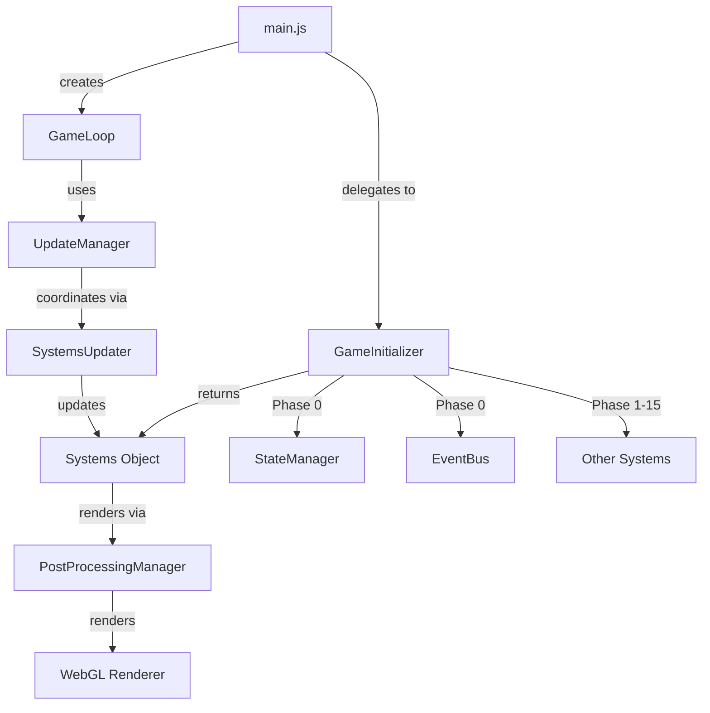

# Developer Quick Start Guide

**Last Updated**: December 10, 2025  
**Status**: Complete with Playwright Test Suite

**Last Updated**: December 10, 2025  
**Target Audience**: New developers joining the project

## Overview

This guide provides a quick introduction to the Errl Club codebase, helping new developers get up to speed quickly.

## Prerequisites

- **Node.js**: v25.2.1 (use `.nvmrc` or check `package.json`)
- **npm**: v10.0.0 or higher
- **Basic Knowledge**: JavaScript (ES6+), Three.js basics, Vite

## Quick Setup

```bash
# Clone the repository
git clone <repository-url>
cd errl-club

# Install dependencies
npm install

# Start development server
npm run dev

# Open http://localhost:5173 in your browser
```

## Project Structure

```
errl-club/
├── src/                    # Source code
│   ├── main.js            # Entry point (minimal, delegates to GameInitializer)
│   ├── style.css          # Global styles
│   ├── avatar/            # Avatar system (ErrlAvatar)
│   ├── audio/             # Audio system (AudioSystem, BeatDetector, etc.)
│   ├── camera/            # Camera controls (CameraController)
│   ├── collectibles/      # Collectible items (DripCollectible, etc.)
│   ├── config/            # Configuration files (SettingsManager, etc.)
│   ├── core/              # Core game systems
│   │   ├── GameInitializer.js  # Main initialization orchestrator
│   │   └── initializers/  # System initializers
│   ├── dev/               # Development tools (DevTools, DevMenu)
│   ├── effects/           # Visual effects (PostProcessingManager, etc.)
│   ├── input/             # Input handling (KeybindManager)
│   ├── interactions/      # Interactive objects (PortalRift, etc.)
│   ├── scene/             # Scene management (CodexAssetIntegration)
│   ├── shaders/           # Custom shaders (MotionBlurShader)
│   ├── systems/           # Game systems (LODSystem, PerformanceOptimizer, etc.)
│   └── ui/                # UI components (BasePanel, various UIs)
├── docs/                  # Documentation
├── public/                # Static assets (models, audio)
└── dist/                  # Build output (generated)
```

## Key Concepts

### Initialization Flow

The game uses a **hybrid initialization approach**:

1. **GameInitializer** handles standard system initialization (Phase 0-15)
2. **main.js** handles custom enhancements (holographic rings, visualizer room, etc.)
3. **GameLoop** manages the animation loop
4. **UpdateManager** coordinates system updates via **SystemsUpdater**

**Initialization Phases** (managed by `GameInitializer`):

1. **Phase 0**: Foundation (StateManager, EventBus) - Phase B systems
2. **Phase 1**: Three.js setup (Scene, Camera, Renderer)
3. **Phase 2**: Input & Keybinds
4. **Phase 3**: Scene Builders
5. **Phase 4**: Post-Processing (async)
6. **Phase 5**: Avatar
7. **Phase 6**: Core Systems
8. **Phase 7**: Interactive Environment
9. **Phase 8**: Effects
10. **Phase 9**: Audio
11. **Phase 10**: UI
12. **Phase 10.5**: Settings & Trackers
13. **Phase 11-14**: Resize, controls, keybinds, mouse
14. **Phase 15**: PostFX ready + GameLoop
15. **Phase 16-18**: Interactive registration, audio init, dev tools

See `docs/initialization_flow.md` for detailed flow diagram.

### Main Entry Point

**`src/main.js`** (898 lines, down from 1,404 - 36% reduction):
- Uses **GameInitializer** for standard initialization
- Adds custom enhancements (holographic rings, visualizer room teleporter, etc.)
- Sets up GameLoop and UpdateManager
- Handles user-interaction-dependent initialization (audio)

**`src/core/GameInitializer.js`**: Orchestrates all standard system initialization in the correct order.

**Hybrid Approach**: Standard initialization via GameInitializer, custom code in main.js. See `docs/refactoring/HYBRID_APPROACH.md` for details.

### System Architecture



## Key Systems

### Core Systems

- **`GameInitializer`**: Main initialization orchestrator (standard systems)
- **`GameLoop`**: Animation loop manager
- **`UpdateManager`**: Coordinates system updates
- **`SystemsUpdater`**: Consolidates all system update calls
- **`StateManager`**: Global state management (Phase B)
- **`EventBus`**: Event system for decoupled communication (Phase B)
- **`SettingsManager`**: Persistent settings storage

### Game Systems

- **`ErrlAvatar`**: Player avatar controller
- **`CameraController`**: Camera movement and presets
- **`CollisionSystem`**: Collision detection
- **`InteractionSystem`**: Interactive object handling
- **`CollectibleManager`**: Collectible item management
- **`ReplaySystem`**: Movement replay recording/playback
- **`LODSystem`**: Level of Detail for performance
- **`PerformanceOptimizer`**: Automatic FPS adjustment

### Audio Systems

- **`AudioSystem`**: Main audio manager
- **`BeatDetector`**: Beat detection from audio
- **`FrequencyBandExtractor`**: Frequency band analysis (bass, mid, treble)
- **`FootstepSystem`**: Footstep audio

### Visual Systems

- **`PostProcessingManager`**: Post-processing effects (bloom, SSAO, etc.)
- **`VisualEffects`**: Visual effect system
- **`ParticleSystem`**: Particle effects
- **`CodexAssetIntegration`**: 3D asset loading and integration

### UI Systems

- **`BasePanel`**: Base class for all UI panels
- **`CollectionGoalsUI`**: Collection goals tracking
- **`AssetAttributionPanel`**: Asset credits display
- **`ReplayLibraryUI`**: Replay management
- **`DevMenu`**: Development tools menu

## Development Workflow

### Making Changes

1. **Start Dev Server**: `npm run dev`
2. **Make Changes**: Edit files in `src/`
3. **Hot Reload**: Changes automatically reload in browser
4. **Check Console**: Open browser DevTools for errors

### Code Quality

```bash
# Format code
npm run format

# Check formatting
npm run format:check

# Lint code
npm run lint

# Fix linting issues
npm run lint:fix

# Run both checks
npm run check
```

### Adding New Features

1. **Create Module**: Add new file in appropriate directory
2. **Follow Patterns**: Use existing code as reference
3. **Add JSDoc**: Document classes and methods
4. **Integrate**: Add to `GameInitializer` if it's a system
5. **Test**: Verify in browser
6. **Format**: Run `npm run format`

### Adding New Systems

1. **Create System Class**: In `src/systems/`
2. **Add Initializer**: Create or update initializer in `src/core/initializers/`
3. **Wire in GameInitializer**: Add initialization in correct phase
4. **Add to SystemsUpdater**: Add update call in `src/core/updates/SystemsUpdater.js`
5. **Document**: Update relevant documentation

**Note**: The animation loop is managed by `GameLoop` and `UpdateManager`. System updates should be added to `SystemsUpdater`, not directly to `main.js`.

## Common Tasks

### Adding a New UI Panel

```javascript
import { BasePanel } from './BasePanel.js';

export class MyNewPanel extends BasePanel {
    constructor(config = {}) {
        super({
            id: 'my-new-panel',
            title: 'My New Panel',
            ...config
        });
        this.createUI();
    }
    
    createUI() {
        // Create UI elements
    }
}
```

### Adding a New System

```javascript
export class MyNewSystem {
    constructor(dependencies) {
        this.dependencies = dependencies;
    }
    
    update(deltaTime) {
        // Update logic
    }
}
```

### Adding Keybinds

Keybinds are registered in `src/core/initializers/SetupInitializer.js`:

```javascript
keybindManager.registerKeybind(
    'key',
    { shift: true }, // modifiers
    () => {
        // Handler
    },
    'Description'
);
```

## Debugging

### DevTools

- **F1**: Toggle debug overlay (FPS, stats)
- **F2**: Toggle 3D debug overlay
- **Ctrl+D**: Open DevMenu
- **?**: Show controls help

### Console Logging

- Use `console.log()` for debugging
- Use `console.warn()` for warnings
- Use `console.error()` for errors
- Check browser console for errors

### Performance Monitoring

- **F1**: Shows FPS and stats
- **DevMenu**: Performance Optimizer section
- **Chrome DevTools**: Performance tab for profiling

## Testing

### Manual Testing

See `docs/testing/2025-12-10-TESTING_SUMMARY.md` for comprehensive test procedures.

### Automated Testing

```bash
# Run all tests
npm test

# Run E2E tests
npm run test:e2e

# Run unit tests
npm run test:unit

# Run tests with browser visible
npm run test:headed
```

## Documentation

### Key Documentation Files

- **`README.md`**: Project overview
- **`docs/README.md`**: Documentation index
- **`docs/initialization_flow.md`**: Initialization phases
- **`docs/CODEX_FEATURES_GUIDE.md`**: Codex features guide
- **`docs/KEYBINDS_REFERENCE.md`**: Complete keybinds reference
- **`docs/PLAYER_WORKFLOWS.md`**: Player workflows
- **`docs/WORKFLOWS_TODO_LIST.md`**: Feature implementation checklist

### Code Documentation

- All classes have JSDoc comments
- Methods are documented with `@param` and `@returns`
- See existing code for documentation patterns

## Testing

### Running Tests

The project includes a comprehensive Playwright test suite with 705 tests covering all major features.

```bash
# Run all tests
npm test

# Run specific test suites
npm test codex-assets
npm test audio-reactive-features
npm test post-processing-presets

# Run in headed mode (see browser)
npm run test:headed

# Run in debug mode
npm run test:debug

# Show test report
npm run test:report
```

### Test Coverage

- **Total Tests**: 705 across 27 files
- **New Tests (Dec 10)**: 64 tests in 10 new files
- **Coverage**: All major systems and features
- **Browsers**: Chromium, Firefox, WebKit

### Test Files

- `tests/e2e/codex-assets.spec.js` - Codex asset integration
- `tests/e2e/audio-reactive-features.spec.js` - Audio-reactive features
- `tests/e2e/post-processing-presets.spec.js` - Post-processing presets
- `tests/e2e/particle-presets.spec.js` - Particle presets
- `tests/e2e/screen-effects-presets.spec.js` - Screen effects presets
- `tests/e2e/graphics-settings-integration.spec.js` - GraphicsSettings integration
- `tests/e2e/performance-monitoring.spec.js` - Performance monitoring
- `tests/e2e/camera-audio-reactive.spec.js` - Audio-reactive camera
- `tests/e2e/visual-effect-settings.spec.js` - Visual effect settings
- `tests/e2e/quick-settings-menu.spec.js` - Quick settings menu

See `docs/testing/2025-12-10-playwright-test-suite.md` for complete test documentation.

## Troubleshooting

### Common Issues

**Issue**: Dev server won't start
- **Solution**: Check Node.js version (`nvm use`), ensure dependencies installed (`npm install`)

**Issue**: White screen
- **Solution**: Check browser console for errors, verify WebGL support

**Issue**: Assets not loading
- **Solution**: Check `public/models/` directory, verify asset paths

**Issue**: Post-processing not working
- **Solution**: Check `PostProcessingManager` initialization, verify WebGL context

**Issue**: Audio not working
- **Solution**: Check browser audio permissions, verify audio file paths

### Getting Help

1. Check browser console for errors
2. Review relevant documentation
3. Check `docs/testing/` for test procedures
4. Review code comments and JSDoc

## Next Steps

1. **Read Documentation**: Start with `docs/README.md`
2. **Explore Codebase**: Look at `src/main.js` and `GameInitializer.js`
3. **Run Dev Server**: `npm run dev` and explore the game
4. **Review Systems**: Look at key systems in `src/systems/`
5. **Check Examples**: Review existing UI components in `src/ui/`

## Resources

- **Three.js Docs**: https://threejs.org/docs/
- **Vite Docs**: https://vitejs.dev/
- **Project Docs**: `docs/` directory
- **Code Examples**: Existing code in `src/`

---

**Note**: This is a living document. Update it as the project evolves.

