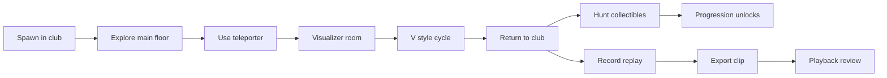

# Player Workflows - Errl Club Simulator

A comprehensive guide to all player journeys, interactions, and workflows in the Errl Club Simulator.

## Table of Contents

1. [Introduction](#introduction)
2. [Exploration Workflows](#exploration-workflows)
3. [Social & Interaction Workflows](#social--interaction-workflows)
4. [Collectibles & Progression Workflows](#collectibles--progression-workflows)
5. [Dancing & Movement Workflows](#dancing--movement-workflows)
6. [Visual Effects & Customization Workflows](#visual-effects--customization-workflows)
7. [Audio & Event Workflows](#audio--event-workflows)
8. [Replay & Recording Workflows](#replay--recording-workflows)
9. [Camera & View Workflows](#camera--view-workflows)
10. [Advanced Interaction Workflows](#advanced-interaction-workflows)
11. [Settings & Customization Workflows](#settings--customization-workflows)
12. [Combined Workflows](#combined-workflows)

---

## Introduction

### Overview

The Errl Club Simulator offers multiple playstyles and player journeys. This document catalogs all possible workflows, from first-time exploration to advanced interactions and customization.

### Player Types

- **Explorers**: Focus on discovering the environment, finding collectibles, and exploring all areas
- **Socializers**: Engage with interactive objects, use emotes, and prepare for multiplayer interactions
- **Dancers**: Focus on movement, dance sequences, and audio-reactive experiences
- **Collectors**: Hunt for all collectibles, track progress, and maximize collection
- **Visual Artists**: Experiment with visual effects, recording, and visual customization
- **Casual Players**: Enjoy the atmosphere, simple interactions, and relaxed exploration

### How to Use This Document

- Each workflow includes step-by-step instructions
- Required controls are clearly marked
- Expected outcomes are described
- Tips and variations are provided
- Related workflows are cross-referenced
- Camera recommendations are included for each workflow

### Workflow Categories

Workflows are organized by activity type. Many workflows can be combined for richer experiences.

---

## Exploration Workflows

### First-Time Player Exploration

**Goal**: Familiarize yourself with the environment and basic controls

**Steps**:
1. Load the game and observe the initial scene
2. Use **WASD** to move your avatar around
3. Use **Mouse Drag** to orbit the camera and see your surroundings
4. Use **Scroll Wheel** to zoom in/out
5. Walk around the main club area to get your bearings
6. Notice the stage, DJ booth, and various interactive elements
7. Press **Tab** to open the emote wheel and try different expressions
8. Press **E** near interactive objects to see what's available

**Expected Outcomes**:
- Understanding of basic movement and camera controls
- Familiarity with the club layout
- Awareness of interactive elements

**Tips**:
- Start with camera preset **1** (normal view) for comfortable exploration
- Use **R** to snap camera behind avatar if you get disoriented
- Take your time - there's no rush

**Related Workflows**: Room Discovery, Finding Interactive Objects

**Camera Recommendation**: Normal preset (1), medium camera intensity

---

### Room Discovery and Navigation

**Goal**: Explore all areas of the club and understand the layout

**Steps**:
1. Start at the center of the main club room
2. Walk toward the stage area (negative Z direction)
3. Explore the sides of the room (positive/negative X directions)
4. Look for teleporter pads (glowing cyan circles)
5. Approach a teleporter and press **E** to activate it
6. You'll be transported to the visualizer room
7. Explore the visualizer room's unique environment
8. Use teleporters to return to the main room
9. Find all doors and see which ones are interactive
10. Locate seating areas and interactive screens

**Expected Outcomes**:
- Complete mental map of the club layout
- Knowledge of all accessible areas
- Understanding of teleporter system

**Tips**:
- Use **Y** to teleport to nearest anchor point if you get lost
- Different camera presets (1, 2, 3) help see different perspectives
- Freecam mode (**F**) allows unrestricted exploration

**Related Workflows**: Finding Interactive Objects, Exploring Visualizer Room

**Camera Recommendation**: Wide preset (3) for overview, or freecam (F) for detailed exploration

---

### Finding Interactive Objects

**Goal**: Discover and catalog all interactive objects in the environment

**Steps**:
1. Walk around the perimeter of the room
2. Look for objects that glow or have visual indicators
3. Approach objects and watch for interaction prompts
4. Press **E** when near interactive objects
5. Try interacting with:
   - **Doors**: Open/close mechanisms
   - **Teleporters**: Transport pads
   - **Seatable Objects**: Chairs, benches, platforms
   - **Interactive Screens**: Display panels
   - **Fog Vents**: Atmospheric effects
   - **Ventilation Fans**: Air flow effects
   - **Portal Rifts**: Dimensional portals
   - **Pushable Props**: Movable objects
   - **Camera Console**: Camera controls
   - **Lighting Console**: Lighting controls

**Expected Outcomes**:
- Complete list of all interactive objects
- Understanding of what each object does
- Knowledge of interaction mechanics

**Tips**:
- Some objects require specific conditions to activate
- Interactive objects often have visual or audio feedback
- Use cinematic camera mode (**C**) for better observation

**Related Workflows**: Advanced Interaction Workflows, Social & Interaction Workflows

**Camera Recommendation**: Normal preset with medium intensity for comfortable interaction

---

### Discovering Collectibles

**Goal**: Find and understand all collectible types

**Steps**:
1. Walk around the club area
2. Look for glowing objects on the floor and in the air
3. Approach collectibles - they will be collected automatically when close
4. Identify the four collectible types:
   - **Drips**: Colorful drops that appear on surfaces
   - **Bubbles**: Floating bubbles that pop when touched
   - **Errl Fragments**: Special collectibles for progression
   - **Glow Balls**: Rare collectibles with special effects
5. Notice the collection feedback (sounds, particles)
6. Track your collection progress

**Expected Outcomes**:
- Understanding of all collectible types
- Knowledge of spawn locations
- Collection mechanics comprehension

**Tips**:
- Collectibles respawn periodically
- Some collectibles are rarer than others
- Running (**Shift + WASD**) helps cover more ground

**Related Workflows**: Collectibles & Progression Workflows

**Camera Recommendation**: Normal preset, low intensity for focused collection

---

### Exploring Visualizer Room

**Goal**: Experience the special visualizer room environment

**Steps**:
1. Find a teleporter pad in the main club
2. Stand on the teleporter (glowing cyan circle)
3. Press **E** to activate teleportation
4. Arrive in the visualizer room
5. Observe the intense visual effects and lighting
6. Walk around the visualizer room
7. Try different visualizer styles using **V** key
8. Experiment with visual effects in this enhanced environment
9. Use teleporter to return to main room

**Expected Outcomes**:
- Experience of the visualizer room's unique atmosphere
- Understanding of enhanced visual effects
- Knowledge of how to access special areas

**Tips**:
- Visualizer room has more intense effects - adjust camera intensity if needed
- Try different visualizer styles for different experiences
- The room is designed for high-energy moments

**Related Workflows**: Visual Effects & Customization Workflows, Audio & Event Workflows

**Camera Recommendation**: Medium intensity, cinematic mode for immersive experience

---

### Finding Hidden Areas

**Goal**: Discover secret or less obvious areas

**Steps**:
1. Explore behind objects and structures
2. Look for teleporters in less obvious locations
3. Check areas behind the stage
4. Explore corners and edges of the room
5. Use freecam mode (**F**) to see from different angles
6. Look for visual indicators of hidden areas
7. Try interacting with objects that seem non-interactive
8. Check for collectibles in hidden spots

**Expected Outcomes**:
- Discovery of all accessible areas
- Knowledge of secret locations
- Understanding of environment boundaries

**Tips**:
- Freecam mode is invaluable for exploration
- Some areas may only be accessible via teleporters
- Hidden collectibles often mark special areas

**Related Workflows**: Room Discovery, Collectibles Discovery

**Camera Recommendation**: Freecam mode (F) for unrestricted exploration

---

## Social & Interaction Workflows

### Using Emotes and Expressions

**Goal**: Express yourself through emotes and avatar expressions

**Steps**:
1. Press **Tab** to open the emote wheel
2. Use mouse or arrow keys to navigate the wheel
3. Select an emote to perform it
4. Your avatar will animate the selected emote
5. Try all 8 available emotes
6. Combine emotes with movement for dynamic expressions
7. Use emotes near other players (future multiplayer)
8. Emotes can be used while moving or stationary

**Expected Outcomes**:
- Understanding of all available emotes
- Ability to express different moods
- Knowledge of emote controls

**Tips**:
- Emotes can be canceled by moving
- Some emotes work better in certain situations
- Combine with camera angles for better viewing

**Related Workflows**: Social Gathering Scenarios, Dancing Workflows

**Camera Recommendation**: Intimate preset (2) to see emotes clearly, low intensity for stable viewing

---

### Sitting on Objects

**Goal**: Use seatable objects to rest and observe

**Steps**:
1. Find a seatable object (chair, bench, platform)
2. Approach the object
3. Press **E** when prompted to sit
4. Your avatar will sit down on the object
5. While sitting, you can still look around with camera
6. Press movement keys or **E** again to stand up
7. Try different seatable objects for different perspectives

**Expected Outcomes**:
- Ability to use seating for rest
- Different viewing angles from seated positions
- Understanding of seating mechanics

**Tips**:
- Seating is great for observing the environment
- Some seats offer better views than others
- You can still use emotes while seated

**Related Workflows**: Social Gathering, Exploration

**Camera Recommendation**: Adjust camera to see from seated perspective, medium intensity

---

### Interacting with Doors

**Goal**: Open and close doors to access different areas

**Steps**:
1. Find a door in the environment
2. Approach the door
3. Press **E** to interact
4. Door will open or close based on current state
5. Walk through open doors
6. Interact again to close doors behind you
7. Some doors may have automatic closing timers

**Expected Outcomes**:
- Understanding of door mechanics
- Ability to control access to areas
- Knowledge of which doors are interactive

**Tips**:
- Doors provide visual feedback when interactive
- Some areas may require doors to be open
- Doors can be used strategically for navigation

**Related Workflows**: Exploration, Navigation

**Camera Recommendation**: Normal preset, low intensity for precise interaction

---

### Using Teleporters

**Goal**: Quickly move between locations using teleporter pads

**Steps**:
1. Locate a teleporter pad (glowing cyan circle)
2. Walk onto the teleporter pad
3. Wait for activation (may have a brief delay)
4. Press **E** to activate teleportation
5. Experience the teleportation effect
6. Arrive at destination location
7. Teleporters have cooldowns between uses
8. Use **Y** to teleport to nearest anchor point

**Expected Outcomes**:
- Fast travel between locations
- Access to special areas (like visualizer room)
- Understanding of teleporter network

**Tips**:
- Teleporters are marked with glowing effects
- Cooldown prevents rapid teleportation
- Some teleporters go to specific destinations

**Related Workflows**: Exploration, Room Discovery

**Camera Recommendation**: Medium intensity to see teleportation effects, or low for stable view

---

### Engaging with Interactive Screens

**Goal**: Interact with display screens and panels

**Steps**:
1. Find interactive screens in the environment
2. Approach the screen
3. Press **E** to interact
4. Screen may display information or change visuals
5. Some screens may have multiple interaction states
6. Observe screen responses to interactions
7. Screens may react to audio or events

**Expected Outcomes**:
- Understanding of screen interactions
- Access to information or effects
- Knowledge of screen locations

**Tips**:
- Screens often provide visual feedback
- Some screens may be audio-reactive
- Screens can enhance the atmosphere

**Related Workflows**: Advanced Interactions, Audio Reactions

**Camera Recommendation**: Normal preset, adjust to see screen content clearly

---

## Collectibles & Progression Workflows

### Collecting Drips

**Goal**: Gather drip collectibles throughout the environment

**Steps**:
1. Walk around the club area
2. Look for colorful drops on surfaces (drips)
3. Approach drips - they auto-collect when close enough
4. Notice the collection sound and particle effect
5. Drips come in various colors (cyan, magenta, yellow, green, red)
6. Continue collecting drips as you explore
7. Drips respawn periodically in random locations

**Expected Outcomes**:
- Collection of drip items
- Understanding of drip spawn mechanics
- Visual/audio feedback from collection

**Tips**:
- Running helps cover more ground for collection
- Drips spawn in various locations
- Some areas have higher drip density

**Related Workflows**: Collectibles Discovery, Progression Tracking

**Camera Recommendation**: Normal preset, low intensity for focused collection

---

### Popping Bubbles

**Goal**: Interact with bubble collectibles

**Steps**:
1. Look for floating bubbles in the air
2. Approach bubbles
3. Bubbles pop when you get close or touch them
4. Experience the pop effect (sound, particles)
5. Bubbles come in different sizes
6. Some bubbles may float and move
7. Continue finding and popping bubbles

**Expected Outcomes**:
- Interaction with bubble collectibles
- Understanding of bubble mechanics
- Collection of bubble-related effects

**Tips**:
- Bubbles are often found in clusters
- Jumping (**Space**) can help reach floating bubbles
- Bubbles provide satisfying pop feedback

**Related Workflows**: Collectibles Discovery, Movement Workflows

**Camera Recommendation**: Normal preset, can use intimate view (2) for close-up bubble popping

---

### Gathering Errl Fragments

**Goal**: Collect Errl fragments for progression

**Steps**:
1. Search for Errl fragments (special collectibles)
2. Fragments are typically rarer than drips
3. Approach fragments to collect them
4. Notice special collection feedback
5. Track fragment count (displayed in UI)
6. Fragments may be needed for progression or achievements
7. Continue hunting for fragments

**Expected Outcomes**:
- Collection of Errl fragments
- Progress toward collection goals
- Understanding of fragment importance

**Tips**:
- Fragments are less common - explore thoroughly
- Some fragments may be in hidden areas
- Fragment collection may unlock features

**Related Workflows**: Progression Tracking, Exploration

**Camera Recommendation**: Normal preset, low intensity for careful searching

---

### Collecting Glow Balls

**Goal**: Find and collect rare glow ball collectibles

**Steps**:
1. Search for glow balls (rare, glowing collectibles)
2. Glow balls have distinctive appearance
3. Approach glow balls to collect
4. Experience special collection effects
5. Glow balls may have unique properties
6. Track glow ball collection
7. Glow balls may spawn less frequently

**Expected Outcomes**:
- Collection of rare glow balls
- Special effects from collection
- Progress in rare collectible hunting

**Tips**:
- Glow balls are rare - be patient
- Check all areas thoroughly
- Glow balls may have special spawn conditions

**Related Workflows**: Collectibles Discovery, Progression

**Camera Recommendation**: Normal preset, adjust to spot glow effects

---

### Tracking Collection Progress

**Goal**: Monitor your collectible collection progress

**Steps**:
1. Collect various collectibles as you play
2. Notice collection feedback (sounds, particles)
3. Check UI elements for collection counts
4. Track progress on different collectible types:
   - Total drips collected
   - Bubbles popped
   - Errl fragments gathered
   - Glow balls found
5. Set collection goals for yourself
6. Continue collecting to reach goals

**Expected Outcomes**:
- Awareness of collection progress
- Motivation to continue collecting
- Understanding of collection mechanics

**Tips**:
- Collection progress may be saved
- Set personal collection goals
- Different collectibles have different rarities

**Related Workflows**: All Collectibles Workflows

**Camera Recommendation**: Any preset, focus on gameplay

---

### Using Collectibles for Effects

**Goal**: Understand how collectibles affect gameplay

**Steps**:
1. Collect various collectibles
2. Notice how collection affects:
   - Visual effects
   - Audio feedback
   - Particle systems
   - Vibe meter (if applicable)
3. Some collectibles may trigger special effects
4. Experiment with collection timing
5. Observe environmental reactions to collection

**Expected Outcomes**:
- Understanding of collectible effects
- Knowledge of collection impact
- Appreciation of collection mechanics

**Tips**:
- Different collectibles have different effects
- Collection may influence other systems
- Effects may be cumulative

**Related Workflows**: Audio & Event Workflows, Visual Effects

**Camera Recommendation**: Medium intensity to see effects, or low for focused collection

---

## Dancing & Movement Workflows

### Basic Movement (Walk, Run)

**Goal**: Master basic avatar movement

**Steps**:
1. Use **W** to move forward
2. Use **S** to move backward
3. Use **A** to move left
4. Use **D** to move right
5. Combine keys for diagonal movement
6. Hold **Shift** while moving to run
7. Release movement keys to stop
8. Practice smooth movement transitions

**Expected Outcomes**:
- Comfortable with basic movement
- Ability to navigate the environment
- Understanding of walk vs run speeds

**Tips**:
- Movement is smooth with acceleration/deceleration
- Running is faster but uses more "energy"
- Practice precise movement for interactions

**Related Workflows**: All movement-based workflows

**Camera Recommendation**: Normal preset, adjust intensity to comfort level

---

### Advanced Movement (Crouch, Hop, Dash)

**Goal**: Master advanced movement techniques

**Steps**:
1. **Crouch**: Hold **Ctrl** while moving or stationary
2. **Hop**: Press **Space** to jump/hop
3. **Dash**: Hold **Shift** and press **Space** for dash
4. Combine movements: crouch + hop, run + dash
5. Practice movement combos
6. Use advanced movement for:
   - Reaching higher areas
   - Quick repositioning
   - Evading (future gameplay)
   - Style and expression

**Expected Outcomes**:
- Mastery of all movement types
- Ability to perform movement combos
- Understanding of movement applications

**Tips**:
- Crouching changes avatar height
- Hopping has physics (gravity, landing)
- Dash provides quick burst of speed
- Movement combos can be stylish

**Related Workflows**: Dance Sequences, Movement Combos

**Camera Recommendation**: Medium intensity to see movement effects, adjust to preference

---

### Dance Sequences

**Goal**: Perform dance moves and sequences

**Steps**:
1. Press **Shift + D** to enter dance mode
2. Avatar will perform dance animations
3. Combine dance with movement for dynamic dancing
4. Try different dance states (dance1, dance2, dance3)
5. Use camera modes to view your dancing
6. Combine with emotes for varied expression
7. Dance in rhythm with audio (if available)
8. Use visual effects to enhance dance experience

**Expected Outcomes**:
- Ability to perform dances
- Understanding of dance mechanics
- Enjoyment of dance animations

**Tips**:
- Dance mode can be toggled
- Different dance states have different animations
- Camera angles enhance dance viewing
- Audio-reactive dancing is more immersive

**Related Workflows**: Audio & Event Workflows, Visual Effects

**Camera Recommendation**: Cinematic mode (C) or intimate preset (2), medium-high intensity for dynamic feel

---

### Movement Combos

**Goal**: Create fluid movement combinations

**Steps**:
1. Start with basic movement (walk/run)
2. Add hop (**Space**) during movement
3. Combine with dash (**Shift + Space**)
4. Add crouch (**Ctrl**) for low movement
5. Transition between movement types smoothly
6. Create your own movement style
7. Use combos for:
   - Navigation efficiency
   - Style and expression
   - Reaching difficult areas
   - Impressive movement sequences

**Expected Outcomes**:
- Ability to perform movement combos
- Personal movement style
- Efficient navigation techniques

**Tips**:
- Practice makes perfect
- Smooth transitions look better
- Different combos for different situations
- Movement is part of self-expression

**Related Workflows**: All Movement Workflows

**Camera Recommendation**: Adjust based on combo type, medium intensity for dynamic feel

---

### Camera Modes for Dancing

**Goal**: Use camera effectively while dancing

**Steps**:
1. Enter dance mode (**Shift + D**)
2. Try different camera presets:
   - **1**: Normal view
   - **2**: Intimate/close view
   - **3**: Wide view
3. Use cinematic mode (**C**) for orbiting view
4. Use lock-on mode (**L**) to focus on avatar
5. Adjust camera intensity for desired feel
6. Use freecam (**F**) for creative angles
7. Snap camera behind avatar (**R**) for reset

**Expected Outcomes**:
- Optimal camera setup for dancing
- Understanding of camera options
- Enhanced dance viewing experience

**Tips**:
- Cinematic mode provides dynamic orbiting
- Intimate preset shows details better
- Adjust intensity to avoid motion sickness
- Different angles for different dance moves

**Related Workflows**: Dance Sequences, Camera & View Workflows

**Camera Recommendation**: Cinematic mode with medium-high intensity, or intimate preset with low intensity

---

### Movement-Based Interactions

**Goal**: Use movement to interact with environment

**Steps**:
1. Use movement to reach collectibles
2. Jump to reach higher areas
3. Dash to quickly reach interaction points
4. Crouch to fit through low areas (if applicable)
5. Use movement to trigger environmental reactions
6. Movement may affect:
   - Particle effects
   - Audio reactivity
   - Visual feedback
   - World state

**Expected Outcomes**:
- Understanding of movement interactions
- Ability to use movement strategically
- Knowledge of movement effects

**Tips**:
- Different movements have different effects
- Movement speed affects interactions
- Some interactions require specific movements
- Experiment to discover interactions

**Related Workflows**: All Movement and Interaction Workflows

**Camera Recommendation**: Adjust based on interaction type

---

## Visual Effects & Customization Workflows

### Toggling UV/Blacklight Mode

**Goal**: Activate UV/blacklight visual mode

**Steps**:
1. Press **U** to toggle UV/blacklight mode
2. Observe the visual transformation
3. Materials change to UV-reactive appearance
4. Emissive effects become more prominent
5. Colors shift to UV spectrum
6. Press **U** again to toggle off
7. Experiment with UV mode in different areas

**Expected Outcomes**:
- Visual transformation to UV mode
- Different atmosphere and mood
- Understanding of UV mode effects

**Tips**:
- UV mode changes the entire visual style
- Some areas look better in UV mode
- Combine with other visual effects
- UV mode affects all materials

**Related Workflows**: Visual Customization, Visual Effects

**Camera Recommendation**: Medium intensity to see effects, adjust to preference

---

### Changing Visualizer Styles

**Goal**: Switch between different visualizer style presets

**Steps**:
1. Press **V** to open visualizer style picker
2. Use dropdown to select style:
   - **DEFAULT**: Standard visualizer style
   - **NEON**: High contrast, bright colors
   - **RETRO**: Warmer colors, vintage feel
   - **CYBERPUNK**: Cool colors, high saturation
   - **MINIMAL**: Subtle effects, restrained
   - **INTENSE**: Maximum intensity, full power
3. Observe visual changes
4. Try different styles for different moods
5. Styles affect audio-reactive visuals

**Expected Outcomes**:
- Ability to change visualizer styles
- Understanding of style differences
- Personalized visual experience

**Tips**:
- Different styles for different activities
- Some styles are more intense than others
- Styles affect all visual effects
- Experiment to find favorites

**Related Workflows**: Visual Customization, Audio & Event Workflows

**Camera Recommendation**: Adjust intensity based on style - intense styles may need lower camera intensity

---

### Activating Glitch Mode

**Goal**: Enable glitch visual effects

**Steps**:
1. Press **Shift + G** to toggle glitch mode
2. Observe glitch effects on visuals
3. Glitch affects:
   - Screen distortion
   - Color shifts
   - Visual artifacts
   - Post-processing effects
4. Press **Shift + G** again to toggle off
5. Combine with other visual effects

**Expected Outcomes**:
- Glitch visual effects activated
- Understanding of glitch mode
- Enhanced visual experience

**Tips**:
- Glitch mode is intense - adjust camera intensity if needed
- Works well with high-energy moments
- Can be combined with other effects
- May affect performance slightly

**Related Workflows**: Visual Effects, Audio & Event Workflows

**Camera Recommendation**: Lower intensity recommended for glitch mode to avoid overwhelming effects

---

### Using Visual Recorder

**Goal**: Record visual sequences for capture

**Steps**:
1. Press **Ctrl + R** to toggle visual recording
2. Recording indicator appears
3. Perform actions while recording
4. Frames are captured during recording
5. Press **Ctrl + R** again to stop recording
6. Recorded frames can be exported (if implemented)
7. Use for:
   - Capturing moments
   - Creating content
   - Documenting experiences
   - Sharing sequences

**Expected Outcomes**:
- Ability to record visual sequences
- Understanding of recording system
- Captured visual content

**Tips**:
- Recording may affect performance
- Plan your recording sequences
- Combine with visual effects for better results
- Recording works with all visual modes

**Related Workflows**: Replay & Recording, Visual Effects

**Camera Recommendation**: Adjust based on what you're recording

---

### Triggering Color Inversion Flash

**Goal**: Create dramatic color inversion moments

**Steps**:
1. Press **I** to trigger color inversion flash
2. Observe the dramatic color shift
3. Colors invert briefly
4. Effect fades back to normal
5. Use at key musical moments
6. Combine with other visual effects
7. Timing matters for maximum impact

**Expected Outcomes**:
- Dramatic visual moment
- Understanding of color inversion
- Enhanced visual experience

**Tips**:
- Best used at high-energy moments
- Timing with audio enhances effect
- Can be overwhelming - adjust camera intensity
- Works well with other effects

**Related Workflows**: Audio & Event Workflows, Visual Effects

**Camera Recommendation**: Lower intensity recommended to avoid overwhelming flash

---

### Customizing Visual Experience

**Goal**: Create your preferred visual setup

**Steps**:
1. Experiment with all visual modes:
   - UV mode (**U**)
   - Visualizer styles (**V**)
   - Glitch mode (**Shift + G**)
   - Color inversion (**I**)
2. Combine different effects
3. Adjust camera intensity for comfort
4. Find your preferred visual style
5. Save preferences (if available)
6. Create different setups for different activities

**Expected Outcomes**:
- Personalized visual experience
- Understanding of all visual options
- Optimal setup for your preferences

**Tips**:
- Different combinations create different moods
- Adjust camera intensity to match visual intensity
- Some combinations work better than others
- Experiment to find what you like

**Related Workflows**: All Visual Effects Workflows, Settings & Customization

**Camera Recommendation**: Adjust intensity to match visual intensity - lower for intense visuals

---

## Audio & Event Workflows

### Reacting to Beat Detection

**Goal**: Experience audio-reactive gameplay

**Steps**:
1. Audio system detects beats automatically
2. Observe reactions to beats:
   - Lighting changes
   - Particle effects
   - Visual effects
   - Camera shake (if enabled)
3. Move and dance in rhythm
4. Watch vibe meter respond to audio
5. Strong beats trigger stronger effects
6. Different frequency bands affect different elements

**Expected Outcomes**:
- Understanding of audio reactivity
- Appreciation of beat-synced effects
- Enhanced immersive experience

**Tips**:
- Audio reactivity is automatic
- Stronger beats = stronger effects
- Movement enhances the experience
- Vibe meter tracks your energy

**Related Workflows**: Dancing Workflows, Event Workflows

**Camera Recommendation**: Medium intensity to feel beat reactions, adjust to preference

---

### Triggering Blackout Events

**Goal**: Create dramatic blackout moments

**Steps**:
1. Press **B** to trigger blackout event
2. Observe the dramatic lighting change
3. Lights dim or turn off
4. Special effects during blackout
5. Lights return after event
6. Use for dramatic moments
7. Combine with other effects

**Expected Outcomes**:
- Dramatic blackout event
- Understanding of event system
- Enhanced atmosphere

**Tips**:
- Blackouts create dramatic moments
- Best used at appropriate times
- Works well with audio
- Can be combined with other events

**Related Workflows**: Event Workflows, Visual Effects

**Camera Recommendation**: Lower intensity for blackout events to avoid disorientation

---

### Activating Strobe Events

**Goal**: Create intense strobe lighting effects

**Steps**:
1. Press **Shift + S** to trigger strobe event
2. Observe rapid strobe lighting
3. Lights flash rapidly
4. Effects sync with strobe
5. Strobe continues for duration
6. Use for high-energy moments
7. Combine with audio for maximum effect

**Expected Outcomes**:
- Intense strobe lighting event
- High-energy atmosphere
- Understanding of strobe system

**Tips**:
- Strobe can be intense - adjust camera intensity
- Best for high-energy moments
- Works well with dancing
- May affect some players (photosensitivity)

**Related Workflows**: Event Workflows, Dancing Workflows

**Camera Recommendation**: Lower intensity strongly recommended for strobe events

---

### Creating Wave Events

**Goal**: Trigger wave-like lighting effects

**Steps**:
1. Press **Shift + W** to trigger wave event
2. Observe wave-like lighting pattern
3. Lights create wave motion
4. Effects propagate through environment
5. Wave continues for duration
6. Use for dynamic moments
7. Combine with movement for immersion

**Expected Outcomes**:
- Wave lighting event
- Dynamic visual effect
- Understanding of wave system

**Tips**:
- Waves create flowing motion
- Works well with audio
- Can be combined with other effects
- Creates dynamic atmosphere

**Related Workflows**: Event Workflows, Visual Effects

**Camera Recommendation**: Medium intensity to see wave motion

---

### Audio-Reactive Interactions

**Goal**: Experience how audio affects the environment

**Steps**:
1. Observe automatic audio analysis
2. Watch how different frequency bands affect:
   - Bass: Strong effects, camera shake
   - Mid: Moderate effects
   - Treble: Subtle effects
3. Notice audio-reactive:
   - Lighting
   - Particles
   - Visual effects
   - Camera movements
4. Move in rhythm with audio
5. Watch vibe meter respond

**Expected Outcomes**:
- Understanding of audio reactivity
- Appreciation of synced effects
- Enhanced immersive experience

**Tips**:
- Audio reactivity is automatic
- Different frequencies affect different things
- Movement enhances reactivity
- Vibe meter tracks your energy

**Related Workflows**: All Audio Workflows, Dancing Workflows

**Camera Recommendation**: Adjust intensity based on audio intensity - lower for strong bass

---

### Vibe Meter Progression

**Goal**: Build and track your vibe/energy level

**Steps**:
1. Observe the vibe meter UI element
2. Vibe meter increases with:
   - Movement and dancing
   - Audio energy
   - Interactions
   - Collectibles
3. Watch vibe meter fill up
4. High vibe levels may trigger:
   - Special effects
   - Visual changes
   - Enhanced audio reactivity
5. Maintain high vibe through activity
6. Track your vibe progression

**Expected Outcomes**:
- Understanding of vibe system
- Ability to build vibe
- Knowledge of vibe effects

**Tips**:
- Active play builds vibe faster
- Dancing and movement help
- High vibe unlocks special effects
- Vibe may decay when inactive

**Related Workflows**: Dancing Workflows, Audio Workflows, Collectibles Workflows

**Camera Recommendation**: Any preset, focus on gameplay

---

## Replay & Recording Workflows

### Starting Replay Recording

**Goal**: Begin recording your avatar's movements

**Steps**:
1. Press **T** to start replay recording
2. Recording indicator appears (if available)
3. Move and perform actions
4. All movements are recorded:
   - Position
   - Rotation
   - State
   - Velocity
5. Recording continues until stopped
6. Maximum recording duration applies (30 seconds)

**Expected Outcomes**:
- Replay recording started
- Movements being tracked
- Understanding of recording system

**Tips**:
- Plan your recording sequence
- Recording has time limit
- All movements are captured
- Recording can be stopped anytime

**Related Workflows**: Stopping Replay, Spawning Ghost Replays

**Camera Recommendation**: Any preset, adjust to see your actions

---

### Stopping Replay Recording

**Goal**: End replay recording session

**Steps**:
1. Press **T** again to stop recording
2. Recording stops immediately
3. Recorded data is stored
4. Recording indicator disappears
5. You can now spawn ghost replay
6. Recording data is ready for playback

**Expected Outcomes**:
- Recording stopped
- Data saved for replay
- Ready to spawn ghost

**Tips**:
- Stop recording when sequence is complete
- Recording stops automatically at time limit
- Data is immediately available
- Can start new recording after stopping

**Related Workflows**: Starting Replay, Spawning Ghost Replays

**Camera Recommendation**: Any preset

---

### Spawning Ghost Replays

**Goal**: Play back recorded movement as a ghost avatar

**Steps**:
1. Record a sequence using **T**
2. Stop recording with **T**
3. Press **G** to spawn ghost replay
4. Ghost avatar appears at recording start position
5. Ghost replays your recorded movements
6. Ghost is semi-transparent
7. Watch ghost perform your sequence
8. Ghost disappears when replay completes

**Expected Outcomes**:
- Ghost avatar replaying your movements
- Visual playback of recording
- Understanding of replay system

**Tips**:
- Ghost shows exactly what you recorded
- Ghost is semi-transparent for visibility
- Multiple recordings can be made
- Ghost replays at recorded speed

**Related Workflows**: Starting/Stopping Replay, Watching Replay Playback

**Camera Recommendation**: Cinematic mode (C) or freecam (F) to watch ghost from different angles

---

### Watching Replay Playback

**Goal**: Observe ghost replay from optimal angles

**Steps**:
1. Spawn ghost replay with **G**
2. Use camera controls to view ghost:
   - Orbit around ghost
   - Zoom in/out
   - Use different presets
   - Try cinematic mode
   - Use freecam for creative angles
3. Follow ghost's movement
4. Observe replay from multiple angles
5. Ghost completes and disappears

**Expected Outcomes**:
- Optimal viewing of replay
- Understanding of replay from different angles
- Appreciation of recorded sequence

**Tips**:
- Different camera angles show different perspectives
- Cinematic mode provides dynamic viewing
- Freecam allows creative angles
- Follow ghost for best viewing

**Related Workflows**: Spawning Ghost Replays, Camera Workflows

**Camera Recommendation**: Cinematic mode (C) with medium intensity for dynamic viewing

---

### Multiple Replay Management

**Goal**: Create and manage multiple replay recordings

**Steps**:
1. Record first sequence with **T**
2. Stop recording with **T**
3. Spawn ghost with **G**
4. Record new sequence (previous may be cleared)
5. Create multiple recordings
6. Spawn different ghosts
7. Compare different recordings
8. Manage replay library (if available)

**Expected Outcomes**:
- Ability to create multiple replays
- Understanding of replay management
- Library of recorded sequences

**Tips**:
- Each new recording may replace previous
- Plan your recording sessions
- Different recordings for different purposes
- Replays can be used for content creation

**Related Workflows**: All Replay Workflows

**Camera Recommendation**: Adjust based on viewing needs

---

## Camera & View Workflows

### Switching Camera Presets

**Goal**: Change camera view using preset positions

**Steps**:
1. Press **1** for normal preset (default view)
2. Press **2** for intimate preset (close view)
3. Press **3** for wide preset (distant view)
4. Observe camera transition
5. Each preset has different:
   - Distance from avatar
   - Vertical angle
   - Field of view
6. Switch presets based on activity
7. Presets provide quick view changes

**Expected Outcomes**:
- Ability to switch camera views quickly
- Understanding of preset differences
- Optimal view for current activity

**Tips**:
- Normal preset: Balanced view
- Intimate preset: Close, detailed view
- Wide preset: Overview, environmental view
- Switch based on what you're doing

**Related Workflows**: All Camera Workflows

**Camera Recommendation**: Adjust intensity based on preset - wider views may need lower intensity

---

### Using Cinematic Mode

**Goal**: Activate cinematic orbiting camera mode

**Steps**:
1. Press **C** to toggle cinematic mode
2. Camera begins orbiting around avatar
3. Observe smooth orbital motion
4. Camera maintains distance and angle
5. Orbiting speed is adjustable (via settings)
6. Press **C** again to exit cinematic mode
7. Use for:
   - Observing avatar
   - Dynamic viewing
   - Content creation
   - Immersive experience

**Expected Outcomes**:
- Cinematic orbiting camera
- Dynamic camera movement
- Understanding of cinematic mode

**Tips**:
- Cinematic mode provides automatic movement
- Great for observing your avatar
- Orbiting speed can be adjusted
- Works well with dancing and movement

**Related Workflows**: Camera Presets, Dancing Workflows

**Camera Recommendation**: Medium-high intensity for cinematic feel, or lower for stable viewing

---

### Activating Freecam Mode

**Goal**: Detach camera from avatar for free exploration

**Steps**:
1. Press **F** to toggle freecam mode
2. Camera detaches from avatar
3. Use **WASD** to move camera
4. Use **Mouse** to rotate camera view
5. Use **Scroll Wheel** to move forward/backward
6. Explore environment freely
7. Press **F** again to return to follow mode
8. Use for:
   - Exploration
   - Finding hidden areas
   - Creative viewing
   - Content creation

**Expected Outcomes**:
- Free camera movement
- Ability to explore independently
- Understanding of freecam controls

**Tips**:
- Freecam allows unrestricted movement
- Great for exploration
- Can see environment from any angle
- Useful for finding collectibles

**Related Workflows**: Exploration, Camera Presets

**Camera Recommendation**: Low-medium intensity for precise freecam control

---

### Lock-On Camera Mode

**Goal**: Focus camera on specific target

**Steps**:
1. Press **L** to toggle lock-on mode
2. Camera focuses on lock-on target
3. Camera follows target smoothly
4. Maintains optimal viewing distance
5. Press **L** again to release lock-on
6. Use for:
   - Focusing on objects
   - Following other players (future)
   - Observing interactions
   - Stable viewing

**Expected Outcomes**:
- Focused camera on target
- Smooth following motion
- Understanding of lock-on system

**Tips**:
- Lock-on provides stable focus
- Great for observing specific things
- Smooth following motion
- Can be combined with other modes

**Related Workflows**: Camera Presets, Interaction Workflows

**Camera Recommendation**: Low-medium intensity for stable lock-on viewing

---

### Camera Snap Behind Avatar

**Goal**: Quickly reset camera position behind avatar

**Steps**:
1. Press **R** to snap camera behind avatar
2. Camera instantly moves behind avatar
3. Camera aligns with avatar's forward direction
4. Useful when camera gets disoriented
5. Quick reset for camera position
6. Use frequently for navigation

**Expected Outcomes**:
- Camera reset behind avatar
- Proper camera alignment
- Quick orientation reset

**Tips**:
- Very useful for navigation
- Quick way to reset camera
- Aligns with movement direction
- Use when lost or disoriented

**Related Workflows**: All Camera Workflows, Navigation

**Camera Recommendation**: Low intensity for quick snap without motion sickness

---

### Adjusting Camera for Different Activities

**Goal**: Optimize camera for specific activities

**Steps**:
1. Identify current activity:
   - Exploration: Wide preset or freecam
   - Dancing: Cinematic or intimate preset
   - Collecting: Normal preset
   - Interaction: Normal or intimate preset
   - Viewing: Cinematic or freecam
2. Select appropriate camera mode
3. Adjust camera intensity if needed
4. Fine-tune with presets
5. Switch as activity changes

**Expected Outcomes**:
- Optimal camera for each activity
- Understanding of camera choices
- Enhanced experience for each activity

**Tips**:
- Different activities need different views
- Adjust intensity to match activity intensity
- Switch cameras as needed
- Find your preferences

**Related Workflows**: All Camera and Activity Workflows

**Camera Recommendation**: Varies by activity - adjust intensity accordingly

---

## Advanced Interaction Workflows

### Using Camera Console

**Goal**: Interact with camera control console

**Steps**:
1. Find camera console in environment
2. Approach camera console
3. Press **E** to interact
4. Console may provide:
   - Camera controls
   - View options
   - Camera settings
   - Special camera modes
5. Use console interface
6. Exit console when done

**Expected Outcomes**:
- Access to camera console features
- Understanding of console system
- Enhanced camera control

**Tips**:
- Console provides advanced camera options
- May have unique features
- Experiment with console controls
- Console enhances camera experience

**Related Workflows**: Camera Workflows, Interaction Workflows

**Camera Recommendation**: Adjust based on console features

---

### Using Lighting Console

**Goal**: Control lighting through interactive console

**Steps**:
1. Find lighting console in environment
2. Approach lighting console
3. Press **E** to interact
4. Console may control:
   - Room lighting
   - Effect lighting
   - Color schemes
   - Lighting intensity
5. Adjust lighting settings
6. Observe lighting changes
7. Exit console when done

**Expected Outcomes**:
- Control over lighting
- Understanding of lighting system
- Customized lighting environment

**Tips**:
- Lighting affects atmosphere
- Experiment with different settings
- Lighting can enhance other effects
- Console provides creative control

**Related Workflows**: Visual Effects, Interaction Workflows

**Camera Recommendation**: Adjust to see lighting changes clearly

---

### Interacting with Fog Vents

**Goal**: Activate and interact with fog vent effects

**Steps**:
1. Find fog vents in environment
2. Approach fog vent
3. Press **E** to interact (if interactive)
4. Fog vent may:
   - Emit fog particles
   - Create atmospheric effects
   - React to proximity
   - Provide visual enhancement
5. Observe fog effects
6. Fog may be audio-reactive
7. Interact multiple times if possible

**Expected Outcomes**:
- Fog vent activation
- Atmospheric effects
- Understanding of fog system

**Tips**:
- Fog adds atmosphere
- May be automatic or manual
- Works well with lighting
- Enhances visual experience

**Related Workflows**: Visual Effects, Interaction Workflows

**Camera Recommendation**: Medium intensity to see fog effects

---

### Using Ventilation Fans

**Goal**: Interact with ventilation fan systems

**Steps**:
1. Find ventilation fans in environment
2. Approach fan
3. Press **E** to interact (if interactive)
4. Fan may:
   - Create air flow effects
   - Generate particles
   - Affect avatar movement
   - Provide visual effects
5. Observe fan effects
6. Fans may be always active
7. Interact with multiple fans

**Expected Outcomes**:
- Fan interaction
- Air flow effects
- Understanding of fan system

**Tips**:
- Fans create dynamic effects
- May affect movement slightly
- Works with other systems
- Adds environmental detail

**Related Workflows**: Interaction Workflows, Visual Effects

**Camera Recommendation**: Normal preset to see fan effects

---

### Portal Rift Interactions

**Goal**: Interact with dimensional portal rifts

**Steps**:
1. Find portal rifts in environment
2. Approach portal rift
3. Observe portal visual effects
4. Press **E** to interact (if interactive)
5. Portal may:
   - Transport to other location
   - Create visual effects
   - Provide special access
   - Generate particles
6. Interact with portal
7. Experience portal effects

**Expected Outcomes**:
- Portal interaction
- Understanding of portal system
- Special effects or transport

**Tips**:
- Portals are visually distinct
- May have special functions
- Experiment with interactions
- Portals may be rare

**Related Workflows**: Teleporter Workflows, Visual Effects

**Camera Recommendation**: Medium intensity to see portal effects

---

### Pushable Props

**Goal**: Interact with and move pushable objects

**Steps**:
1. Find pushable props in environment
2. Approach prop
3. Press **E** to interact or push
4. Prop may move when pushed
5. Use movement to push props
6. Props may have physics
7. Experiment with prop movement
8. Props may affect environment

**Expected Outcomes**:
- Ability to move props
- Understanding of prop system
- Environmental interaction

**Tips**:
- Props add interactivity
- Physics may apply
- Some props may be heavy
- Experiment with pushing

**Related Workflows**: Interaction Workflows, Movement Workflows

**Camera Recommendation**: Normal preset to see prop movement

---

### Throwable Drips

**Goal**: Throw drip objects for effects

**Steps**:
1. Collect drips (automatic collection)
2. Press **Q** to throw a drip
3. Drip is thrown in forward direction
4. Observe drip trajectory
5. Drip may create effects on impact
6. Throw multiple drips
7. Experiment with throwing
8. Drips may have physics

**Expected Outcomes**:
- Ability to throw drips
- Understanding of throwable system
- Interactive drip usage

**Tips**:
- Throwing adds interactivity
- Drips may create effects
- Experiment with throwing angles
- Can be used creatively

**Related Workflows**: Collectibles Workflows, Interaction Workflows

**Camera Recommendation**: Normal preset to see throwing action

---

## Settings & Customization Workflows

### Adjusting Camera Intensity

**Goal**: Customize camera movement intensity for comfort

**Steps**:
1. Open camera settings (keybind to be added)
2. Select intensity preset:
   - **Low**: Minimal camera movement
   - **Medium**: Moderate camera movement
   - **High**: Full camera movement and effects
   - **Custom**: Individual control over all aspects
3. If custom, adjust individual settings:
   - Camera sensitivity
   - Smoothness/spring stiffness
   - Shake intensity
   - Effect intensity
   - Post-processing camera effects
4. Preview changes in real-time
5. Save settings
6. Settings persist across sessions

**Expected Outcomes**:
- Customized camera intensity
- Comfortable camera experience
- Understanding of camera settings

**Tips**:
- Lower intensity reduces motion
- Adjust to your comfort level
- Different activities may need different settings
- Settings can be changed anytime

**Related Workflows**: All Camera Workflows, Settings Workflows

**Camera Recommendation**: Start with low intensity and adjust up as comfortable

---

### Changing Graphics Settings

**Goal**: Adjust graphics quality and effects

**Steps**:
1. Open settings menu
2. Navigate to graphics settings
3. Adjust quality presets or individual settings:
   - Post-processing effects
   - Shadow quality
   - Particle count
   - Visual effect intensity
4. Apply changes
5. Observe performance impact
6. Find balance between quality and performance

**Expected Outcomes**:
- Optimized graphics settings
- Better performance (if needed)
- Preferred visual quality

**Tips**:
- Lower settings improve performance
- Higher settings enhance visuals
- Find your balance
- Settings affect camera feel

**Related Workflows**: Settings Workflows, Performance Optimization

**Camera Recommendation**: Adjust based on graphics settings

---

### Modifying Audio Settings

**Goal**: Customize audio experience

**Steps**:
1. Open settings menu
2. Navigate to audio settings
3. Adjust:
   - Master volume
   - Music volume
   - Effect volume
   - Audio quality
4. Apply changes
5. Test audio levels
6. Fine-tune as needed

**Expected Outcomes**:
- Customized audio levels
- Comfortable audio experience
- Understanding of audio settings

**Tips**:
- Adjust to comfortable levels
- Balance different audio sources
- Audio affects overall experience
- Settings persist

**Related Workflows**: Settings Workflows, Audio Workflows

**Camera Recommendation**: Any preset

---

### Customizing Keybinds

**Goal**: Remap controls to preferred keys

**Steps**:
1. Open settings menu
2. Navigate to keybind settings
3. Select action to remap
4. Press new key for action
5. Confirm keybind change
6. Test new keybind
7. Remap multiple actions as needed
8. Save keybind changes

**Expected Outcomes**:
- Customized keybinds
- Preferred control scheme
- Understanding of keybind system

**Tips**:
- Remap to comfortable keys
- Avoid conflicts between keybinds
- Test all keybinds
- Settings persist

**Related Workflows**: Settings Workflows, All Interaction Workflows

**Camera Recommendation**: Any preset

---

### Performance Optimization

**Goal**: Improve game performance

**Steps**:
1. Open settings menu
2. Check performance metrics (FPS, etc.)
3. Adjust graphics settings:
   - Lower quality presets
   - Reduce particle count
   - Disable intensive effects
   - Lower post-processing
4. Adjust camera intensity (lower = less processing)
5. Monitor performance improvement
6. Find optimal settings for your system

**Expected Outcomes**:
- Improved performance
- Stable frame rate
- Optimal settings for system

**Tips**:
- Lower settings = better performance
- Camera intensity affects performance
- Find your system's sweet spot
- Balance quality and performance

**Related Workflows**: Settings Workflows, Graphics Settings

**Camera Recommendation**: Lower intensity can improve performance

---

### Accessibility Settings

**Goal**: Adjust settings for accessibility needs

**Steps**:
1. Open settings menu
2. Navigate to accessibility options
3. Adjust:
   - Camera intensity (reduce motion)
   - Visual effect intensity
   - Audio levels
   - Keybind alternatives
   - UI scaling (if available)
4. Test accessibility settings
5. Fine-tune for comfort
6. Save settings

**Expected Outcomes**:
- Accessible game experience
- Comfortable settings
- Understanding of accessibility options

**Tips**:
- Lower camera intensity helps with motion sensitivity
- Reduce visual effects if needed
- Adjust audio for hearing needs
- Customize controls for physical needs

**Related Workflows**: Settings Workflows, Camera Intensity

**Camera Recommendation**: Low intensity recommended for accessibility

---

## Combined Workflows

### Full Session Examples

**Example 1: First-Time Exploration Session**

1. Load game and observe environment
2. Use WASD to move around
3. Try camera presets (1, 2, 3)
4. Press Tab to try emotes
5. Collect some drips
6. Find and use a teleporter
7. Explore visualizer room
8. Try different visualizer styles (V)
9. Return to main room
10. Interact with doors and objects
11. Try dancing (Shift + D)
12. Experiment with camera modes

**Example 2: Collection-Focused Session**

1. Start collection session
2. Use wide camera preset (3) for overview
3. Run around collecting drips (Shift + WASD)
4. Pop bubbles as found
5. Search for Errl fragments
6. Hunt for glow balls
7. Use freecam (F) to find hidden collectibles
8. Track collection progress
9. Continue until goals met

**Example 3: Visual Effects Session**

1. Start visual effects exploration
2. Try UV mode (U)
3. Switch visualizer styles (V)
4. Activate glitch mode (Shift + G)
5. Trigger color inversion (I)
6. Start visual recording (Ctrl + R)
7. Perform actions while recording
8. Stop recording (Ctrl + R)
9. Combine different effects
10. Experiment with combinations

**Example 4: Dance and Movement Session**

1. Start dance-focused session
2. Set camera to cinematic mode (C)
3. Enter dance mode (Shift + D)
4. Try different movement combos
5. Combine with emotes (Tab)
6. React to audio beats
7. Watch vibe meter increase
8. Try different camera angles
9. Record dance sequence (T)
10. Spawn ghost replay (G)

---

### Multi-Objective Playthroughs

**Combining Multiple Goals**

- **Exploration + Collection**: Explore while collecting all items
- **Dancing + Visual Effects**: Dance with visual effects active
- **Social + Recording**: Interact and record for sharing
- **Camera Experimentation + Exploration**: Try all camera modes while exploring
- **Event Triggering + Visual Effects**: Combine events with visual modes

**Tips for Multi-Objective Playthroughs**:
- Plan your session goals
- Switch between activities
- Adjust camera for each activity
- Combine workflows naturally
- Have fun experimenting

---

### Achievement Hunting

**Goal**: Complete specific achievements or challenges

**Potential Achievements**:
- Collect all collectible types
- Visit all areas
- Use all interactive objects
- Perform all movement types
- Try all visual effects
- Record multiple replays
- Build high vibe meter
- Complete specific sequences

**Workflow**:
1. Identify achievement goals
2. Plan approach
3. Execute required actions
4. Track progress
5. Complete achievement
6. Move to next achievement

---

### Social Gathering Scenarios

**Goal**: Prepare for or simulate social interactions (future multiplayer)

**Workflow**:
1. Choose gathering location
2. Set up visual atmosphere (visual effects)
3. Use emotes to express mood
4. Position avatar appropriately
5. Use camera to view scene
6. Interact with environment
7. Create welcoming atmosphere
8. Prepare for other players

**Tips**:
- Use seating for social areas
- Emotes enhance social presence
- Visual effects set mood
- Camera angles show scene well

---

### Performance/Recording Sessions

**Goal**: Create content or record gameplay

**Workflow**:
1. Plan recording sequence
2. Set up visual effects
3. Choose camera angles
4. Start visual recording (Ctrl + R)
5. Perform planned actions
6. Use camera modes effectively
7. Trigger events at right moments
8. Stop recording (Ctrl + R)
9. Review recorded content
10. Create ghost replays (G) for viewing

**Tips**:
- Plan sequences in advance
- Camera angles matter
- Timing is important
- Combine effects for impact
- Multiple takes are okay

---

## Camera Intensity Recommendations Summary

### Low Intensity (Recommended for)
- First-time players
- Motion sensitivity
- Precise interactions
- Accessibility needs
- Intense visual effects
- Strobe events
- Performance optimization
- Focused collection
- Stable viewing

### Medium Intensity (Recommended for)
- Regular gameplay
- Balanced experience
- Most activities
- Normal exploration
- Standard interactions
- Audio-reactive moments
- General use

### High Intensity (Recommended for)
- Experienced players
- High-energy moments
- Dynamic experiences
- Cinematic viewing
- Dancing sequences
- Immersive experiences
- Content creation

### Custom Intensity (Recommended for)
- Specific preferences
- Fine-tuned control
- Activity-specific settings
- Advanced users
- Optimal personalization

---

## Conclusion

This document covers all major player workflows in the Errl Club Simulator. Use it as a reference guide to explore all features and create your own unique experiences. Remember to adjust camera intensity to your comfort level, and don't hesitate to experiment with different combinations of features.

**Key Takeaways**:
- There are many ways to play and experience the game
- Camera intensity can be adjusted for comfort
- Different activities benefit from different camera settings
- Experimentation leads to discovery
- Personalization enhances the experience

Enjoy your journey through the Errl Club!
