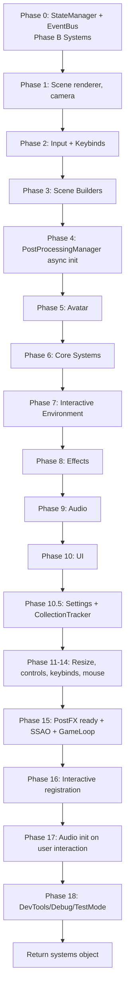
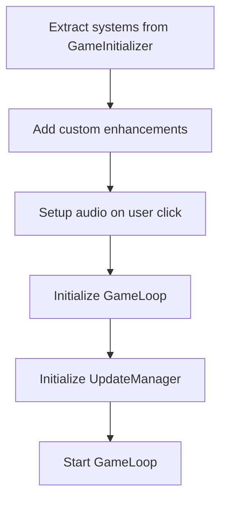
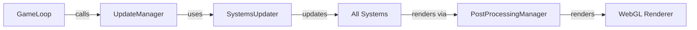

# Initialization Flow

**Last Updated**: December 10, 2025  
**Architecture**: Hybrid approach (GameInitializer + main.js)

## GameInitializer Phases

## main.js Custom Initialization

After GameInitializer completes:

## Update Loop Architecture

## Notes

- **Phase 0**: Foundation systems (StateManager, EventBus) - Phase B systems
- **Phases 1-15**: Standard initialization via GameInitializer
- **main.js**: Custom enhancements and user-interaction-dependent setup
- **GameLoop**: Manages animation loop (started after post-processing ready)
- **UpdateManager**: Coordinates system updates via SystemsUpdater
- **SystemsUpdater**: Consolidates all system update calls
- Post-processing setup runs async; game loop waits for it before starting
- SettingsManager loads camera settings; CollectionTracker wires into CollectibleManager and AudioSystem
- Dev tools are last to avoid impacting core setup; they attach to `window` for testing

## Related Documentation

- `docs/refactoring/HYBRID_APPROACH.md` - Hybrid approach details
- `docs/DEVELOPER_QUICKSTART.md` - Developer guide
- `docs/refactoring/REFACTORING_PLAN.md` - Refactoring plan
