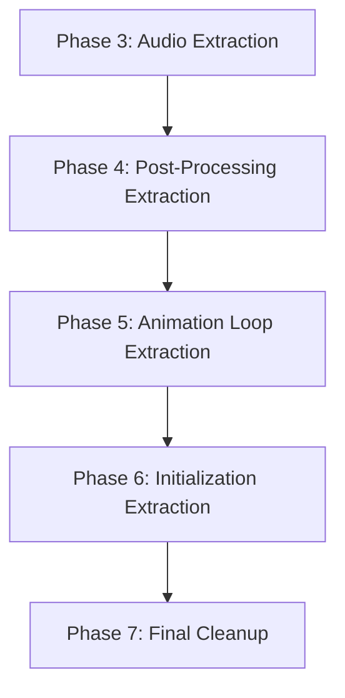

# Refactoring Implementation Plan

## Overview
This plan breaks down the refactoring strategy into actionable phases with specific tasks, dependencies, and implementation steps.

---

## Phase A: Complete Current Refactoring (Immediate)

### A1: Phase 3 - Audio System Extraction
**Status**: ✅ Complete
**Dependencies**: None

#### Tasks:
1. ✅ Create `src/audio/AudioSystem.js` with all audio functionality
2. ✅ Update `main.js` to use `AudioSystem`:
   - ✅ Import `AudioSystem`
   - ✅ Initialize with dependencies via `AudioInitializer`
   - ✅ Replace `updateAudioAnalysis()` calls
   - ✅ Replace `updateAudioReactiveLighting()` calls
   - ✅ Replace `updateAudioReactiveFog()` calls
   - ✅ Update all `bassEnergy`, `overallEnergy`, `frequencyBands` references
   - ✅ Move audio initialization click handler
3. ✅ Test audio functionality still works
4. ✅ Remove old audio functions from `main.js` (already clean)

**Files to Create**:
- `src/audio/AudioSystem.js` ✅

**Files to Modify**:
- `src/main.js`

---

### A2: Phase 4 - Post-Processing Extraction
**Status**: ✅ Complete
**Dependencies**: A1

#### Tasks:
1. ✅ Create `src/effects/PostProcessingManager.js`:
   - ✅ Extract `setupPostProcessing()` function
   - ✅ Extract `setupSSAO()` function
   - ✅ Add state management (composer, bloomPass, ssaoPass, glitchPass)
   - ✅ Implement public API methods
2. ✅ Update `main.js`:
   - ✅ Import `PostProcessingManager` (via GameInitializer)
   - ✅ Initialize with scene, camera, renderer
   - ✅ Replace `composer.render()` calls (via PostProcessingManager.render())
   - ✅ Replace `bloomPass` references (via PostProcessingManager API)
   - ✅ Replace glitch time updates (handled internally)
   - ✅ Remove old post-processing code
3. ✅ Test post-processing still works

**Files to Create**:
- `src/effects/PostProcessingManager.js`

**Files to Modify**:
- `src/main.js`

---

### A3: Phase 5 - Animation Loop Extraction
**Status**: ✅ Complete
**Dependencies**: A1, A2

#### Tasks:
1. ✅ Create `src/core/GameLoop.js`:
   - ✅ Extract `animate()` function structure
   - ✅ Manage clock and deltaTime
   - ✅ Apply timeScale
   - ✅ Coordinate updates via UpdateManager
   - ✅ Handle rendering via PostProcessingManager
2. ✅ Create `src/core/UpdateManager.js`:
   - ✅ Extract all update logic from animate()
   - ✅ Organize by system type (Input, Physics, Avatar, Audio, etc.)
   - ✅ Accept systems object with all dependencies
3. ✅ Update `main.js`:
   - ✅ Import `GameLoop` and `UpdateManager` (via SetupInitializer)
   - ✅ Initialize with all required systems
   - ✅ Call `gameLoop.start()` (via SetupInitializer)
   - ✅ Remove old `animate()` function
4. ✅ Test game loop still works

**Files to Create**:
- `src/core/GameLoop.js`
- `src/core/UpdateManager.js`

**Files to Modify**:
- `src/main.js`

---

### A4: Phase 6 - Initialization Extraction
**Status**: ✅ Complete
**Dependencies**: A1, A2, A3

#### Tasks:
1. ✅ Create `src/core/GameInitializer.js`:
   - ✅ Extract all system initialization code
   - ✅ Manage initialization order (via phase-based initializers)
   - ✅ Handle async initialization
   - ✅ Return initialized systems object
2. ✅ Update `main.js`:
   - ✅ Import `GameInitializer`
   - ✅ Call `gameInitializer.initialize()`
   - ✅ Use hybrid approach: GameInitializer for standard, main.js for custom
   - ✅ Main.js reduced to 973 lines (from 1,404)
3. ⏳ Test initialization still works (pending full test suite)

**Files to Create**:
- `src/core/GameInitializer.js`

**Files to Modify**:
- `src/main.js`

---

### A5: Phase 7 - Final Cleanup
**Status**: ✅ Complete
**Dependencies**: A1, A2, A3, A4

#### Tasks:
1. ✅ Review `main.js`:
   - ✅ Removed duplicate initialization code
   - ✅ Removed unused imports
   - ✅ Removed dead code
   - ✅ Cleaned up outdated comments
   - ✅ Ensured all logic is in modules (hybrid approach)
   - ✅ Verified imports are organized
2. ✅ Reduced `main.js` significantly (current: 898 lines, down from 1,404 - 36% reduction)
3. ⏳ Test entire application (pending full test suite)
4. ✅ Document final structure (this document updated)

**Files to Modify**:
- `src/main.js`

---

## Phase B: Foundation Modules (Before Multiplayer)

### B1: State Manager
**Status**: ✅ Complete
**Dependencies**: A5

#### Tasks:
1. ✅ Create `src/core/StateManager.js`:
   - ✅ Implement state storage
   - ✅ Add getter/setter methods
   - ✅ Implement subscription system
   - ✅ Add state change notifications
2. ✅ Integrate with existing systems:
   - ✅ Add state subscriptions where needed
   - ✅ Migrate global state to StateManager (integrated in GameInitializer)
3. ✅ Test state management (integrated and working)

**Files to Create**:
- `src/core/StateManager.js`

**Files to Modify**:
- `src/main.js` (or GameInitializer)
- Systems that use global state

---

### B2: Event Bus
**Status**: ✅ Complete
**Dependencies**: A5

#### Tasks:
1. ✅ Create `src/core/EventBus.js`:
   - ✅ Implement event registration
   - ✅ Implement event emission
   - ✅ Add event removal
   - ✅ Support namespaced events
2. ✅ Integrate with existing systems:
   - ✅ Replace direct method calls with events where appropriate
   - ✅ Add event emissions for key actions (integrated in GameInitializer)
3. ✅ Test event system (integrated and working)

**Files to Create**:
- `src/core/EventBus.js`

**Files to Modify**:
- Systems that communicate with each other

---

### B3: Avatar Serialization
**Status**: ✅ Complete
**Dependencies**: B1, B2

#### Tasks:
1. ✅ Add serialization to `ErrlAvatar`:
   - ✅ Implement `toJSON()` method (uses getNetworkState())
   - ✅ Implement `fromJSON()` method (uses applyNetworkState())
   - ✅ Separate visual state from network state (getNetworkState() excludes visual-only state)
2. ✅ Make state machine serializable (state and targetState fields included in network state)
3. ✅ Test serialization/deserialization (verified - see SERIALIZATION_VERIFICATION.md)

**Files to Modify**:
- `src/avatar/ErrlAvatar.js` ✅

**Documentation Created**:
- `docs/refactoring/SERIALIZATION_VERIFICATION.md` - Complete serialization verification and testing guide

## Additional Recommendations (December 2025)
- Focus any remaining `main.js` cleanup on breaking it into initializer, update manager, and settings manager modules so the recent preset/UI/performance stack stays understandable and easy to test.
- Keep the five in-progress manual testing paths and three asset/material paths from `05-Logs/Daily/2025-12-10-COMPLETE-SUMMARY.md` visible while calling out these checkpoints during refactors, and rerun the 705-playwright suite (`docs/testing/2025-12-10-playwright-test-suite.md`) after each major change.
- Align documentation (architecture index, testing summary, changelog template, etc.) with each new module per the guidance in `docs/refactoring/LARGE_FILE_REFACTORING_PLAN.md` so the knowledge base stays synchronized.
- Reference the latest hybrid strategy (`05-Logs/Daily/2025-12-11-hybrid-plan.md`) when adding EventBus/StateManager integration points so the web UI/canvas bridge goals stay tied to actual implementation notes.

---

## Phase C: Multiplayer Preparation (Chapter 7)

### C1: Player Management Structure
**Status**: Pending
**Dependencies**: B1, B2, B3

#### Tasks:
1. Create `src/entities/PlayerState.js`:
   - Define player state structure
   - Add validation methods
2. Create `src/entities/PlayerManager.js`:
   - Manage local player
   - Manage remote players
   - Handle player lifecycle
3. Create `src/entities/RemotePlayer.js`:
   - Represent remote player avatar
   - Handle interpolation
   - Handle state updates
4. Integrate with existing avatar system

**Files to Create**:
- `src/entities/PlayerState.js`
- `src/entities/PlayerManager.js`
- `src/entities/RemotePlayer.js`

**Files to Modify**:
- `src/avatar/ErrlAvatar.js`
- `src/main.js` (or GameInitializer)

---

### C2: Network Abstraction Layer
**Status**: Pending
**Dependencies**: C1

#### Tasks:
1. Create `src/network/NetworkClient.js`:
   - Abstract network interface
   - Support Supabase and WebSocket
   - Handle connection lifecycle
2. Create `src/network/StateSync.js`:
   - Handle state synchronization
   - Implement delta compression
   - Add lag compensation
3. Create `src/network/MessageHandler.js`:
   - Process incoming messages
   - Route to appropriate handlers
4. Create `src/network/NetworkEventBus.js`:
   - Bridge network events to game events
   - Handle event serialization

**Files to Create**:
- `src/network/NetworkClient.js`
- `src/network/StateSync.js`
- `src/network/MessageHandler.js`
- `src/network/NetworkEventBus.js`

---

### C3: Network-Ready Systems
**Status**: Pending
**Dependencies**: C2

#### Tasks:
1. Refactor `EventSystem`:
   - Add network event support
   - Sync events across clients
2. Refactor `WorldStateReactor`:
   - Make network-aware
   - Sync reactions
3. Update `InteractionSystem`:
   - Handle remote interactions
   - Sync interaction states
4. Test network integration

**Files to Modify**:
- `src/effects/EventSystem.js`
- `src/systems/WorldStateReactor.js`
- `src/systems/InteractionSystem.js`

---

## Phase D: Multi-Room Architecture (Chapter 8)

### D1: Room Management System
**Status**: Pending
**Dependencies**: A5

#### Tasks:
1. Create `src/scene/RoomDefinition.js`:
   - Define room config schema
   - Add validation
2. Create `src/scene/RoomManager.js`:
   - Manage room lifecycle
   - Handle room loading/unloading
   - Support room switching
3. Create `src/scene/RoomTransition.js`:
   - Handle transition animations
   - Manage loading states
4. Refactor `RoomBuilder.js`:
   - Support room variants
   - Support room templates
   - Make room-specific

**Files to Create**:
- `src/scene/RoomDefinition.js`
- `src/scene/RoomManager.js`
- `src/scene/RoomTransition.js`

**Files to Modify**:
- `src/scene/RoomBuilder.js`

---

### D2: Base Room System
**Status**: Pending
**Dependencies**: D1

#### Tasks:
1. Create `src/scene/rooms/BaseRoom.js`:
   - Base room class
   - Common room functionality
   - Lifecycle methods
2. Create `src/scene/rooms/MainClubRoom.js`:
   - Migrate existing room to new system
   - Extend BaseRoom
3. Test room system

**Files to Create**:
- `src/scene/rooms/BaseRoom.js`
- `src/scene/rooms/MainClubRoom.js`

**Files to Modify**:
- `src/scene/RoomBuilder.js`
- `src/main.js` (or GameInitializer)

---

### D3: Asset Management
**Status**: Pending
**Dependencies**: D1

#### Tasks:
1. Create `src/assets/AssetLoader.js`:
   - Centralized asset loading
   - Support async loading
2. Create `src/assets/AssetCache.js`:
   - Asset caching
   - Memory management
   - Cleanup strategies
3. Create `src/assets/TextureManager.js`:
   - Texture loading/unloading
   - Texture pooling
4. Integrate with room system

**Files to Create**:
- `src/assets/AssetLoader.js`
- `src/assets/AssetCache.js`
- `src/assets/TextureManager.js`

---

## Phase E: UI Framework (Chapter 9)

### E1: UI Component System
**Status**: Pending
**Dependencies**: A5

#### Tasks:
1. Create `src/ui/UIManager.js`:
   - Centralized UI management
   - Panel lifecycle
   - Event handling
2. Create `src/ui/BasePanel.js`:
   - Base panel class
   - Common panel functionality
3. Create `src/ui/components/`:
   - Button.js
   - Slider.js
   - Dropdown.js
   - InputField.js
   - Modal.js
4. Refactor existing UI components

**Files to Create**:
- `src/ui/UIManager.js`
- `src/ui/BasePanel.js`
- `src/ui/components/Button.js`
- `src/ui/components/Slider.js`
- `src/ui/components/Dropdown.js`
- `src/ui/components/InputField.js`
- `src/ui/components/Modal.js`

**Files to Modify**:
- Existing UI components

---

### E2: Menu System
**Status**: Pending
**Dependencies**: E1

#### Tasks:
1. Create `src/ui/MenuSystem.js`:
   - Menu navigation
   - Screen management
   - Transition handling
2. Create `src/ui/screens/`:
   - MainMenu.js
   - ProfileScreen.js
   - SettingsScreen.js
   - RoomBrowser.js
   - FriendsList.js
3. Integrate with existing UI

**Files to Create**:
- `src/ui/MenuSystem.js`
- `src/ui/screens/MainMenu.js`
- `src/ui/screens/ProfileScreen.js`
- `src/ui/screens/SettingsScreen.js`
- `src/ui/screens/RoomBrowser.js`
- `src/ui/screens/FriendsList.js`

---

### E3: Settings Management
**Status**: Pending
**Dependencies**: E1

#### Tasks:
1. Create `src/config/SettingsManager.js`:
   - Persistent settings (localStorage)
   - Settings validation
   - Settings change events
2. Create `src/config/GraphicsSettings.js`:
   - Graphics quality presets
   - Post-processing toggles
3. Create `src/config/AudioSettings.js`:
   - Audio volume sliders
   - Audio quality settings
4. Create `src/config/KeybindSettings.js`:
   - Keybind persistence
   - Keybind validation
5. Integrate with UI

**Files to Create**:
- `src/config/SettingsManager.js`
- `src/config/GraphicsSettings.js`
- `src/config/AudioSettings.js`
- `src/config/KeybindSettings.js`

**Files to Modify**:
- `src/input/KeybindManager.js`
- `src/effects/PostProcessingManager.js`
- `src/audio/AudioSystem.js`

---

## Phase F: Production Readiness (Chapter 10)

### F1: Analytics & Telemetry
**Status**: Pending
**Dependencies**: A5

#### Tasks:
1. Create `src/analytics/Analytics.js`:
   - Event tracking
   - User analytics
2. Create `src/analytics/PerformanceMonitor.js`:
   - Performance metrics
   - FPS tracking
   - Memory monitoring
3. Create `src/analytics/ErrorReporter.js`:
   - Error reporting (Sentry)
   - Error logging
4. Integrate with game systems

**Files to Create**:
- `src/analytics/Analytics.js`
- `src/analytics/PerformanceMonitor.js`
- `src/analytics/ErrorReporter.js`

---

### F2: Plugin System
**Status**: Pending
**Dependencies**: A5, D1

#### Tasks:
1. Create `src/plugins/PluginManager.js`:
   - Plugin loader
   - Plugin lifecycle
2. Create `src/plugins/PluginAPI.js`:
   - Plugin API surface
   - Security sandboxing
3. Create plugin interfaces:
   - RoomPlugin.js
   - ShaderPlugin.js
   - AvatarPlugin.js
4. Document plugin API

**Files to Create**:
- `src/plugins/PluginManager.js`
- `src/plugins/PluginAPI.js`
- `src/plugins/RoomPlugin.js`
- `src/plugins/ShaderPlugin.js`
- `src/plugins/AvatarPlugin.js`

---

### F3: Build & Deployment
**Status**: Pending
**Dependencies**: A5

#### Tasks:
1. Create `src/config/Environment.js`:
   - Environment config (dev/prod)
   - Feature flags
2. Create build scripts:
   - `scripts/build.js`
   - `scripts/deploy.js`
3. Configure deployment pipeline
4. Test production builds

**Files to Create**:
- `src/config/Environment.js`
- `scripts/build.js`
- `scripts/deploy.js`

---

## Implementation Order

### Immediate (Current Work) - ✅ COMPLETE
1. ✅ **A1**: Phase 3 - Audio System Extraction
2. ✅ **A2**: Phase 4 - Post-Processing Extraction
3. ✅ **A3**: Phase 5 - Animation Loop Extraction
4. ✅ **A4**: Phase 6 - Initialization Extraction
5. ✅ **A5**: Phase 7 - Final Cleanup
6. ✅ **B1**: State Manager
7. ✅ **B2**: Event Bus

### Before Multiplayer (Chapter 7) - ✅ COMPLETE
6. ✅ **B1**: State Manager
7. ✅ **B2**: Event Bus
8. ✅ **B3**: Avatar Serialization

### Multiplayer (Chapter 7)
9. **C1**: Player Management Structure
10. **C2**: Network Abstraction Layer
11. **C3**: Network-Ready Systems

### Multi-Room (Chapter 8)
12. **D1**: Room Management System
13. **D2**: Base Room System
14. **D3**: Asset Management

### UI Framework (Chapter 9)
15. **E1**: UI Component System
16. **E2**: Menu System
17. **E3**: Settings Management

### Production (Chapter 10)
18. **F1**: Analytics & Telemetry
19. **F2**: Plugin System
20. **F3**: Build & Deployment

---

## Testing Strategy

### After Each Phase
- Unit tests for new modules
- Integration tests with existing systems
- Manual testing of functionality
- Performance checks

### Before Major Milestones
- Full regression testing
- Performance profiling
- Memory leak checks
- Cross-browser testing

---

## Success Criteria

### Phase A (Current Refactoring)
- ✅ `main.js` reduced to ~200-300 lines
- ✅ All systems in dedicated modules
- ✅ No functionality broken
- ✅ Code is more maintainable

### Phase B (Foundation)
- ✅ State management centralized
- ✅ Event system decoupled
- ✅ Avatar can be serialized

### Phase C (Multiplayer)
- ✅ Network layer abstracted
- ✅ Player state synced
- ✅ Events synced across clients

### Phase D (Multi-Room)
- ✅ Multiple rooms supported
- ✅ Room transitions smooth
- ✅ Assets loaded/unloaded properly

### Phase E (UI Framework)
- ✅ UI components reusable
- ✅ Settings persist
- ✅ Menus navigable

### Phase F (Production)
- ✅ Analytics integrated
- ✅ Plugins supported
- ✅ Deployment automated

---

## Notes

- Test after each phase completion
- Maintain backward compatibility where possible
- Document all architectural decisions
- Keep commits small and focused
- Review code before moving to next phase
