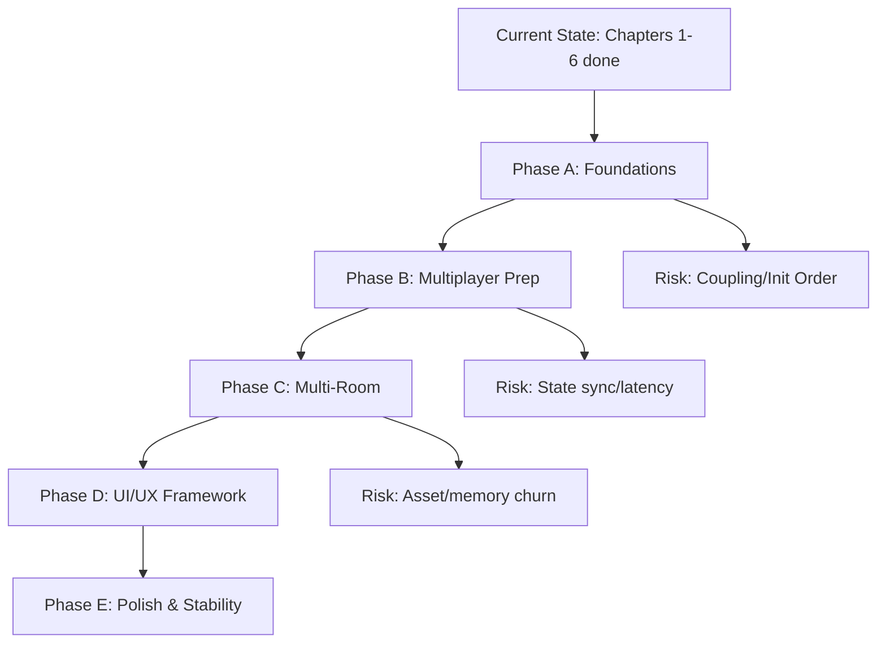

# Refactoring Strategy for Errl Club Simulator



## Current Status
- **Completed**: Chapters 1-6 (Steps 1-300)
- **Current Phase**: Audio & Visual Systems (Chapter 6) - mostly complete
- **Next Up**: Chapter 7 (Multiplayer Infrastructure), Chapter 8 (World Expansion)

## Strategic Refactoring Plan

### Phase A: Foundation Refactoring (Current - Before Multiplayer)
**Goal**: Prepare codebase for multiplayer and multi-room architecture

#### 1. **Core Architecture Modules** ✅ (In Progress)
- ✅ `src/core/GameLoop.js` - Main animation loop
- ✅ `src/core/UpdateManager.js` - System update coordination
- ✅ `src/core/GameInitializer.js` - System initialization
- ⏳ `src/core/StateManager.js` - **NEW**: Centralized game state management
- ⏳ `src/core/EventBus.js` - **NEW**: Global event system for decoupled communication

#### 2. **Scene/Room Management** (Before Chapter 8)
- ⏳ `src/scene/RoomManager.js` - **NEW**: Manages multiple rooms, loading/unloading
- ⏳ `src/scene/RoomDefinition.js` - **NEW**: Room configuration schema
- ⏳ `src/scene/RoomTransition.js` - **NEW**: Handles transitions between rooms
- Refactor `RoomBuilder.js` to support room variants/templates

#### 3. **Player/Entity Management** (Before Chapter 7)
- ⏳ `src/entities/PlayerManager.js` - **NEW**: Manages local and remote players
- ⏳ `src/entities/RemotePlayer.js` - **NEW**: Represents other players
- ⏳ `src/entities/PlayerState.js` - **NEW**: Player state structure for sync
- Refactor `ErrlAvatar.js` to be more network-friendly (state serialization)

#### 4. **Network Layer** (Chapter 7)
- ⏳ `src/network/NetworkClient.js` - **NEW**: Abstract network client (Supabase/WebSocket)
- ⏳ `src/network/StateSync.js` - **NEW**: Handles state synchronization
- ⏳ `src/network/MessageHandler.js` - **NEW**: Processes incoming network messages
- ⏳ `src/network/NetworkEventBus.js` - **NEW**: Bridges network events to game events

#### 5. **UI Framework** (Before Chapter 9)
- ⏳ `src/ui/UIManager.js` - **NEW**: Centralized UI management
- ⏳ `src/ui/BasePanel.js` - **NEW**: Base class for UI panels
- ⏳ `src/ui/MenuSystem.js` - **NEW**: Menu navigation and screens
- Refactor existing UI components to extend `BasePanel`

#### 6. **Settings/Configuration** (Before Chapter 9)
- ⏳ `src/config/SettingsManager.js` - **NEW**: Persistent settings (localStorage)
- ⏳ `src/config/GraphicsSettings.js` - **NEW**: Graphics quality presets
- ⏳ `src/config/AudioSettings.js` - **NEW**: Audio volume sliders
- ⏳ `src/config/KeybindSettings.js` - **NEW**: Keybind persistence

#### 7. **Asset Management** (Before Chapter 8)
- ⏳ `src/assets/AssetLoader.js` - **NEW**: Centralized asset loading
- ⏳ `src/assets/AssetCache.js` - **NEW**: Asset caching and cleanup
- ⏳ `src/assets/TextureManager.js` - **NEW**: Texture loading/unloading
- ⏳ `src/assets/AudioManager.js` - **NEW**: Audio asset management (separate from AudioSystem)

---

### Phase B: Multiplayer Preparation (Chapter 7)

#### 1. **State Serialization**
- Add `serialize()` and `deserialize()` methods to:
  - `ErrlAvatar` - Position, rotation, state, expression
  - `CameraController` - Camera mode, position (if needed)
  - `CollectibleManager` - Collectible states
  - `EventSystem` - Active events

#### 2. **Network-Ready Systems**
- Refactor `EventSystem` to support network events
- Make `WorldStateReactor` network-aware
- Add interpolation to `CameraController` for remote players
- Make `InteractionSystem` handle remote interactions

#### 3. **Player Synchronization**
- Create `PlayerState` interface
- Implement delta compression for position updates
- Add lag compensation
- Implement authoritative server pattern (if using server)

---

### Phase C: Multi-Room Architecture (Chapter 8)

#### 1. **Room System**
```
src/scene/
  ├── RoomManager.js          # Manages all rooms
  ├── RoomDefinition.js        # Room config schema
  ├── RoomBuilder.js           # Builds room geometry (refactored)
  ├── RoomTransition.js        # Handles transitions
  └── rooms/
      ├── BaseRoom.js          # Base room class
      ├── MainClubRoom.js      # Main club room
      ├── FestivalFieldRoom.js # Festival field
      ├── DesertRaveRoom.js    # Desert rave
      └── ...                  # Other room types
```

#### 2. **Room-Specific Systems**
- Each room can have its own:
  - Lighting setup
  - Audio zones
  - Collectible spawners
  - Interactive objects
  - Visual effects

#### 3. **Resource Management**
- Lazy load room assets
- Unload previous room when switching
- Preload adjacent rooms
- Memory management for large worlds

---

### Phase D: UI/UX Framework (Chapter 9)

#### 1. **UI Component System**
```
src/ui/
  ├── UIManager.js             # Main UI coordinator
  ├── BasePanel.js             # Base panel class
  ├── MenuSystem.js            # Menu navigation
  ├── components/
  │   ├── Button.js
  │   ├── Slider.js
  │   ├── Dropdown.js
  │   ├── InputField.js
  │   └── Modal.js
  ├── screens/
  │   ├── MainMenu.js
  │   ├── ProfileScreen.js
  │   ├── SettingsScreen.js
  │   ├── RoomBrowser.js
  │   └── FriendsList.js
  └── ...existing components
```

#### 2. **HUD System**
- Separate HUD from main UI
- Modular HUD elements
- Configurable HUD layout

---

### Phase E: Production Readiness (Chapter 10)

#### 1. **Analytics & Telemetry**
- ⏳ `src/analytics/Analytics.js` - **NEW**: Event tracking
- ⏳ `src/analytics/PerformanceMonitor.js` - **NEW**: Performance metrics
- ⏳ `src/analytics/ErrorReporter.js` - **NEW**: Error reporting (Sentry)

#### 2. **Modding/Plugin System**
- ⏳ `src/plugins/PluginManager.js` - **NEW**: Plugin loader
- ⏳ `src/plugins/PluginAPI.js` - **NEW**: Plugin API surface
- ⏳ `src/plugins/RoomPlugin.js` - **NEW**: Room plugin interface
- ⏳ `src/plugins/ShaderPlugin.js` - **NEW**: Shader plugin interface

#### 3. **Build & Deployment**
- ⏳ `src/config/Environment.js` - **NEW**: Environment config (dev/prod)
- ⏳ `scripts/build.js` - **NEW**: Custom build script
- ⏳ `scripts/deploy.js` - **NEW**: Deployment script

---

## Immediate Refactoring Priorities

### 1. **Complete Current Refactoring** (Phases 3-7)
- ✅ Phase 1: Scene Setup
- ✅ Phase 2: Event Handlers
- ⏳ Phase 3: Audio System (in progress)
- ⏳ Phase 4: Post-Processing
- ⏳ Phase 5: Animation Loop
- ⏳ Phase 6: Initialization
- ⏳ Phase 7: Cleanup

### 2. **Add State Management** (Before Multiplayer)
```javascript
// src/core/StateManager.js
export class StateManager {
  constructor() {
    this.state = {
      player: null,
      room: null,
      settings: {},
      multiplayer: { connected: false, players: [] }
    };
    this.listeners = new Map();
  }
  
  setState(key, value) { /* ... */ }
  getState(key) { /* ... */ }
  subscribe(key, callback) { /* ... */ }
}
```

### 3. **Add Event Bus** (Before Multiplayer)
```javascript
// src/core/EventBus.js
export class EventBus {
  constructor() {
    this.events = new Map();
  }
  
  on(event, callback) { /* ... */ }
  emit(event, data) { /* ... */ }
  off(event, callback) { /* ... */ }
}
```

### 4. **Prepare Avatar for Serialization**
- Add `toJSON()` and `fromJSON()` methods
- Separate visual state from network state
- Make state machine serializable

---

## Code Organization Principles

### 1. **Separation of Concerns**
- **Core**: Game loop, state, initialization
- **Entities**: Avatars, players, NPCs
- **Systems**: Physics, audio, rendering, networking
- **Scene**: Rooms, geometry, lighting
- **UI**: Menus, HUD, panels
- **Network**: Client, sync, messaging
- **Assets**: Loading, caching, management

### 2. **Dependency Injection**
- Pass dependencies through constructors
- Avoid global state where possible
- Use event bus for decoupled communication

### 3. **Interface Contracts**
- Define clear interfaces for systems
- Use TypeScript JSDoc for type hints
- Document expected behavior

### 4. **Extensibility**
- Plugin system for mods
- Room system for new rooms
- Shader system for custom effects
- Event system for custom behaviors

---

## File Structure (Target)

```
src/
├── core/                    # Core game systems
│   ├── GameLoop.js
│   ├── UpdateManager.js
│   ├── GameInitializer.js
│   ├── StateManager.js      # NEW
│   └── EventBus.js          # NEW
│
├── entities/                 # Game entities
│   ├── ErrlAvatar.js        # (moved from avatar/)
│   ├── PlayerManager.js     # NEW
│   ├── RemotePlayer.js      # NEW
│   └── PlayerState.js        # NEW
│
├── systems/                  # Game systems
│   ├── AudioSystem.js       # (moved from audio/)
│   ├── PhysicsSystem.js
│   ├── CollisionSystem.js
│   ├── InteractionSystem.js
│   ├── EventSystem.js
│   └── ...
│
├── scene/                    # Scene/room management
│   ├── RoomManager.js       # NEW
│   ├── RoomBuilder.js
│   ├── LightingSetup.js
│   ├── EnvironmentEffects.js
│   └── rooms/               # NEW
│       ├── BaseRoom.js
│       └── ...
│
├── network/                  # Networking (Chapter 7)
│   ├── NetworkClient.js     # NEW
│   ├── StateSync.js         # NEW
│   ├── MessageHandler.js    # NEW
│   └── NetworkEventBus.js   # NEW
│
├── ui/                       # UI framework
│   ├── UIManager.js         # NEW
│   ├── BasePanel.js        # NEW
│   ├── MenuSystem.js       # NEW
│   ├── components/         # NEW
│   └── screens/            # NEW
│
├── config/                   # Configuration
│   ├── constants.js
│   ├── audioMapping.js
│   ├── SettingsManager.js  # NEW
│   └── Environment.js      # NEW
│
├── assets/                   # Asset management
│   ├── AssetLoader.js      # NEW
│   ├── AssetCache.js       # NEW
│   └── TextureManager.js   # NEW
│
└── main.js                   # Minimal entry point
```

---

## Migration Strategy

### Step 1: Complete Current Refactoring
- Finish Phases 3-7 of main.js refactoring
- Ensure all systems work independently

### Step 2: Add Foundation Modules
- Create `StateManager` and `EventBus`
- Migrate existing systems to use them
- Test thoroughly

### Step 3: Prepare for Multiplayer
- Add serialization to key classes
- Create `PlayerManager` structure
- Set up network abstraction layer

### Step 4: Implement Multiplayer
- Build network layer
- Integrate with existing systems
- Test with multiple clients

### Step 5: Multi-Room System
- Create room management system
- Migrate existing room to new system
- Add room transition system

### Step 6: UI Framework
- Build UI component system
- Migrate existing UI to new framework
- Add new UI screens

---

## Testing Strategy

### Unit Tests
- Test each module independently
- Mock dependencies
- Test edge cases

### Integration Tests
- Test system interactions
- Test network synchronization
- Test room transitions

### Performance Tests
- Monitor frame rate
- Check memory usage
- Profile bottlenecks

---

## Documentation Requirements

### Code Documentation
- JSDoc comments for all public APIs
- README for each major module
- Architecture diagrams

### User Documentation
- Controls guide
- Room descriptions
- Multiplayer guide

### Developer Documentation
- Setup instructions
- Contributing guidelines
- Plugin development guide

---

## Key Decisions

1. **State Management**: Use centralized StateManager vs. distributed state
   - **Decision**: Centralized for multiplayer sync, distributed for performance-critical systems

2. **Event System**: Global EventBus vs. direct method calls
   - **Decision**: EventBus for cross-system communication, direct calls for tight coupling

3. **Room System**: Class-based vs. data-driven
   - **Decision**: Hybrid - BaseRoom class with JSON configs for room definitions

4. **Network Protocol**: Custom vs. existing (Supabase/WebSocket)
   - **Decision**: Abstraction layer supporting both, start with Supabase

5. **UI Framework**: Custom vs. existing library
   - **Decision**: Custom lightweight framework for full control

---

## Next Steps

1. ✅ Complete Phase 3-7 refactoring (current work)
2. ⏳ Add StateManager and EventBus
3. ⏳ Prepare avatar for serialization
4. ⏳ Create network abstraction layer
5. ⏳ Build room management system
6. ⏳ Implement UI framework

---

## Notes

- Keep refactoring incremental - don't break working code
- Test after each major refactoring step
- Maintain backward compatibility where possible
- Document all architectural decisions
- Consider performance implications of each refactoring
