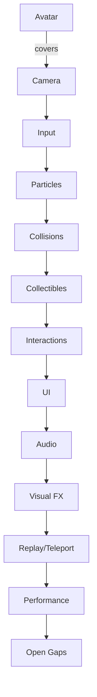

# Comprehensive Testing Checklist

## Phase 0: Comprehensive Testing

### 0.1 Avatar Systems Testing
- [ ] WASD movement (W forward, S backward, A left, D right)
- [ ] Shift + movement = run (faster speed)
- [ ] Ctrl = crouch (squish animation)
- [ ] Space = hop/jump
- [ ] Jump buffering (press Space before landing, should jump again)
- [ ] Dash mechanic (if implemented)
- [ ] Sit animation (if implemented)
- [ ] State transitions (idle → walk → run → idle)
- [ ] Dance states (Shift+D triggers random dance)
- [ ] Expressions change with movement
- [ ] Color variants work
- [ ] Avatar doesn't fall through floor
- [ ] Avatar doesn't clip through walls
- [ ] Landing particles appear
- [ ] Dust particles when walking

### 0.2 Camera System Testing
- [ ] Mouse drag orbits camera around avatar
- [ ] Scroll wheel zooms in/out
- [ ] Zoom limits work (min/max distance)
- [ ] Camera presets (1, 2, 3 keys)
- [ ] R key snaps camera behind avatar
- [ ] Auto-align after movement
- [ ] Camera follows avatar smoothly
- [ ] Camera doesn't clip through geometry
- [ ] Camera shake on bass hits (if audio playing)

### 0.3 Input System Testing
- [ ] All keyboard controls work (WASD, Space, Shift, Ctrl, D, E, Tab, T, G, Y, B, Shift+S, Shift+W)
- [ ] Mouse controls work (drag, scroll)
- [ ] No input conflicts
- [ ] Input feels responsive

### 0.4 Particle Systems Testing
- [ ] Dust particles when walking
- [ ] Landing particles when hopping
- [ ] Dash streak particles (if dash works)
- [ ] Particles clean up (no memory leaks visible)

### 0.5 Collision System Testing
- [ ] Wall collisions (avatar stops/slides)
- [ ] Floor collision (avatar stays on floor)
- [ ] Stage boundaries work
- [ ] Collision with interactive objects

### 0.6 Collectibles System Testing
- [ ] Drips spawn and can be collected
- [ ] Bubbles spawn and can be popped
- [ ] Fragments spawn and collection updates progress bar
- [ ] Glow balls spawn and apply effects
- [ ] Collectibles respawn or have proper limits
- [ ] Collection sounds/effects work

### 0.7 Interactive Objects Testing
- [ ] Doors open/close on proximity
- [ ] Teleporters activate and teleport avatar
- [ ] Fog vents puff with bass energy
- [ ] Seatable objects (sit/stand with E key)
- [ ] Interaction reticle appears when targeting objects

### 0.8 UI Systems Testing
- [ ] Emote wheel opens/closes with Tab
- [ ] All 8 emotes trigger correctly
- [ ] Fragment progress bar displays correctly
- [ ] Interaction reticle appears/disappears
- [ ] UI doesn't block gameplay

### 0.9 Audio System Testing
- [ ] Footstep sounds play during movement
- [ ] Different footstep sounds for floor/stage
- [ ] Distance-based volume (move camera away, verify volume changes)
- [ ] Audio context initializes on user interaction
- [ ] No audio errors in console

### 0.10 Visual Effects Testing
- [ ] Event system (blackout, strobe, wave events)
- [ ] Visual effects (distortion rings, goo trails, laser beams)
- [ ] Hallucination zones
- [ ] Audio-reactive lighting
- [ ] Effects don't cause performance issues

### 0.11 Replay and Teleport Systems Testing
- [ ] T key to record/stop replay
- [ ] G key to spawn ghost
- [ ] Y key for teleport
- [ ] Teleport anchors work
- [ ] Respawn points work

### 0.12 Performance Testing
- [ ] FPS stays above 60fps
- [ ] No memory leaks (monitor over time)
- [ ] Performance with many collectibles
- [ ] Performance with multiple effects active
- [ ] No console errors or warnings

### 0.13 Issues Found
- Critical Bugs:
- Major Bugs:
- Minor Bugs:
- Missing Features:
- Performance Issues:

## Phase A Refactor Validation (Audio / Post-Processing / Game Loop)
- [ ] Audio initialization flows through `AudioInitializer` without directly touching `GameInitializer`; verify that `AudioSystem.initialize()` resolves after user interaction and that the Footstep/Collectible managers register via the provided callbacks.
- [ ] Post-processing settings (bloom, glitch, chromatic aberration) remain configurable via `VisualEffectSettingsUI` and `PostProcessingManager`; check that sliders update live previews and that the composer still renders through `GameLoop`.
- [ ] Game loop instrumentation (time scale control, UpdateManager ordering) applies cleanly to core systems; manually toggle `window.setTimeScale` and ensure physics/audio/updaters keep in sync.
- [ ] Record Phase A runtime testing results in `docs/testing/TESTING_REPORT.md` (new entry per run) including beat detection logs, post-processing toggle states, and any deviations observed.
