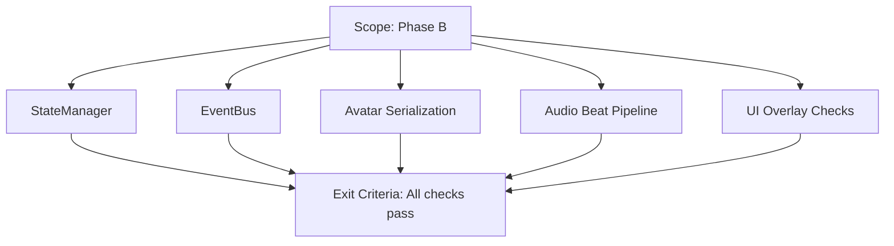

# Phase B Testing Guide



## Browser Testing Instructions

After the game loads, open the browser console and test the following:

### 1. StateManager Testing

```javascript
// Check if StateManager is available
console.log('StateManager:', window.stateManager);

// Test state getter
const playerState = window.stateManager.getState('player.state');
console.log('Player state:', playerState);

// Test state setter
window.stateManager.setState('player.state', 'dance1');
console.log('Set player state to dance1');

// Test subscription
const unsubscribe = window.stateManager.subscribe('player.state', (newValue, oldValue) => {
    console.log('Player state changed:', oldValue, '->', newValue);
});

// Trigger a state change to test subscription
window.stateManager.setState('player.state', 'idle');

// Unsubscribe
unsubscribe();
```

### 2. EventBus Testing

```javascript
// Check if EventBus is available
console.log('EventBus:', window.eventBus);

// Subscribe to an event
const unsubscribe = window.eventBus.on('audio.beat', (data) => {
    console.log('Beat detected!', data);
});

// Check event statistics
const stats = window.eventBus.getStats();
console.log('Event stats:', stats);

// List all events with listeners
const eventNames = window.eventBus.getEventNames();
console.log('Events with listeners:', eventNames);

// Test emitting an event
window.eventBus.emit('test.event', { message: 'Hello from test!' });

// Unsubscribe
unsubscribe();
```

### 3. Avatar Serialization Testing

```javascript
// Get avatar from systems
const avatar = window.gameSystems.avatar;

// Test serialization
const serialized = avatar.toJSON();
console.log('Serialized avatar:', serialized);

// Test deserialization
const testData = {
    position: { x: 5, y: 1, z: -5 },
    rotation: { x: 0, y: 0, z: 0, w: 1 },
    velocity: { x: 0, y: 0, z: 0 },
    state: 'dance1',
    expression: 'happy',
    colorVariant: 'galaxy',
    timestamp: Date.now()
};

avatar.fromJSON(testData);
console.log('Avatar deserialized, check position:', avatar.position);

// Restore original state
avatar.fromJSON(serialized);
console.log('Avatar restored to original state');
```

### 4. Integration Testing

```javascript
// Test that StateManager tracks avatar state
const systems = window.gameSystems;
const stateManager = window.stateManager;
const eventBus = window.eventBus;

// Move avatar and check if state updates
console.log('Current player state:', stateManager.getState('player.state'));
console.log('Current player position:', stateManager.getState('player.position'));

// Wait a frame and check again (state should update automatically)
setTimeout(() => {
    console.log('Player state after movement:', stateManager.getState('player.state'));
    console.log('Player position after movement:', stateManager.getState('player.position'));
}, 1000);

// Check if events are being emitted
let beatCount = 0;
eventBus.on('audio.beat', () => {
    beatCount++;
    console.log('Beat event received, count:', beatCount);
});

// Check player movement events
eventBus.on('player.move', (data) => {
    console.log('Player moved:', data.position);
});

eventBus.on('player.stateChange', (data) => {
    console.log('Player state changed:', data.from, '->', data.to);
});
```

## Expected Results

1. **StateManager**: Should track avatar state, position, rotation, etc. Subscriptions should fire on state changes.

2. **EventBus**: Should emit events for:
   - `audio.beat` - When beats are detected
   - `player.move` - When avatar moves
   - `player.stateChange` - When avatar state changes
   - `interaction.targetChange` - When interaction target changes

3. **Avatar Serialization**: `toJSON()` should return a valid object, and `fromJSON()` should restore avatar state correctly.

## Common Issues

- If StateManager doesn't update: Check that `updateStateManager()` is being called in UpdateManager
- If EventBus doesn't emit: Check that systems have access to eventBus
- If serialization fails: Check that all required properties are included in toJSON()
