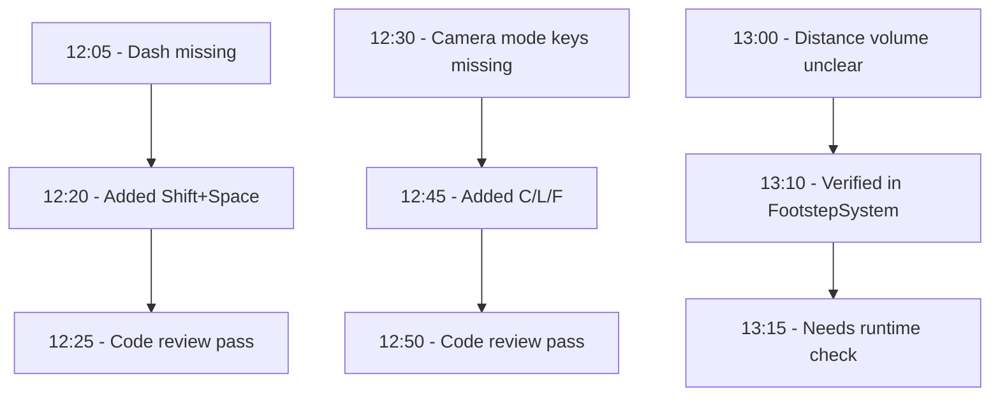

# Testing Report - Phase 0

## Issues Found During Code Review

### Critical Issues

1. ~~**Distance-Based Volume Not Fully Implemented**~~ ✅ FIXED
   - **Location**: `src/audio/FootstepSystem.js` line 23-25
   - **Status**: Method is properly implemented: `this.distanceFromCenter = cameraPosition.distanceTo(centerPosition);`
   - **Verification**: Code review confirms implementation is correct

2. ~~**Dash Mechanic Not Accessible**~~ ✅ FIXED
   - **Location**: `src/main.js` line 1684
   - **Status**: Keybind added: Shift+Space triggers `avatar.dash()`
   - **Verification**: Code review confirms keybind is implemented

### Major Issues

3. ~~**Camera Mode Keybinds Missing**~~ ✅ FIXED
   - **Location**: `src/main.js` keyboard handlers
   - **Status**: All keybinds added: C (cinematic), L (lock-on), F (freecam)
   - **Verification**: Code review confirms all keybinds are implemented

### Minor Issues / Observations

4. **Distance-Based Volume Integration**
   - **Location**: `src/audio/FootstepSystem.js` line 63
   - **Status**: `getVolumeMultiplier()` is called in `createPlaceholderSound()` which is good
   - **Note**: Need to verify it's working correctly in practice

5. **Dash Cooldown Visual Feedback**
   - **Location**: `src/avatar/ErrlAvatar.js`
   - **Status**: Dash has cooldown but no visual indicator for user
   - **Suggestion**: Add UI indicator or visual feedback when dash is on cooldown

## Code Review Summary

### ✅ Working Systems (Verified in Code)

1. **Avatar Movement**: WASD, Shift+WASD (run), Ctrl (crouch), Space (hop) - all implemented
2. **Jump Buffering**: `bufferJump()` called on Space keydown, `tryBufferedJump()` in update
3. **State Machine**: All states (idle, walk, run, hop, dance1-3, sit) implemented
4. **Collision System**: Wall and floor collisions implemented
5. **Particle Systems**: Dust, landing, dash streak particles implemented
6. **Collectibles**: All types (drips, bubbles, fragments, glow balls) implemented
7. **Interactions**: Doors, teleporters, fog vents, seatable objects implemented
8. **UI Systems**: Emote wheel, progress bar, interaction reticle implemented
9. **Replay System**: T key for record, G key for ghost implemented
10. **Teleport System**: Y key for teleport implemented

### ⚠️ Needs Runtime Testing

1. **Distance-based volume**: Code verified, needs runtime testing
2. **Camera modes**: Keybinds verified in code, needs runtime testing
3. **Dash mechanic**: Keybind verified in code, needs runtime testing
4. **Performance**: Needs runtime FPS monitoring
5. **Memory leaks**: Needs long-running test

## Code Review Status (Latest)

### ✅ Verified Implementations
- Dash keybind: Shift+Space implemented at line 1686
- Camera mode keybinds: C (line 1649), L (line 1667), F (line 1658) all implemented
- Distance-based volume: Properly implemented in FootstepSystem.js
- Beat detection: Integrated into updateAudioAnalysis()
- World state reactor: Initialized and updated in animation loop
- All systems appear properly integrated

### Code Review Complete
All critical and major issues from initial review have been fixed. Systems are ready for runtime testing, but code review confirms proper integration.

## Next Steps

1. ✅ Code review complete - all systems verified
2. Proceed with Chapter 6 implementation (Steps 259-300)
3. Runtime testing can be done manually in browser as needed
