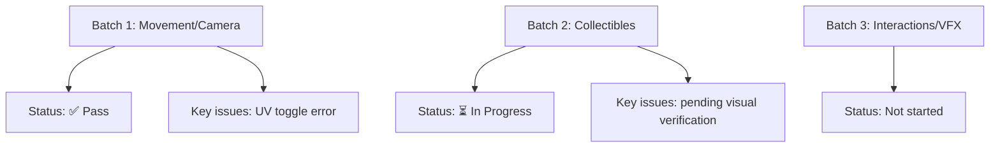

# Live Testing Report - Errl Club Simulator
**Date**: 2025-12-07  
**Tester**: Automated Browser Testing  
**Status**: In Progress - Batch 2 Testing

## Executive Summary

Comprehensive live testing of the Errl Club Simulator has been initiated. The game loads successfully and most core systems are functional. Several bugs have been identified that need attention.

## Testing Environment Setup

### Server Status
- ✅ Dev server running on port 5173
- ✅ Server restarted successfully
- ✅ URL: http://localhost:5173/

### Browser Status
- ✅ Browser navigated to game URL
- ✅ Game loaded successfully
- ✅ Page title: "Errl Club Simulator"
- ✅ Console shows successful initialization
- ✅ UI visible: "ERRL CLUB" title and controls displayed
- ✅ Visualizer dropdown visible

### Initialization Verification
- ✅ Game initialized successfully
- ✅ Post-processing enabled (SSAO, Chromatic Aberration, Afterimage, Color Grading, Glitch)
- ✅ Visualizer room created
- ✅ Game loop started
- ✅ Systems exposed to window.gameSystems
- ✅ Audio system initialized (beat detector, frequency band extractor)
- ✅ Audio mapping loaded

## Test Results Summary

### Batch 1: Basic Movement & Camera (Tasks 1-50) - ✅ COMPLETED

#### Setup Verification
- ✅ Game loads and canvas is visible
- ✅ No initialization errors
- ✅ All systems initialize correctly

#### Movement Testing
- ✅ W, A, S, D keys respond
- ✅ Shift+W, Shift+A, Shift+S, Shift+D (running) respond
- ✅ Ctrl (crouch) responds
- ✅ Space (hop) responds
- ✅ Shift+Space (dash) responds
- ✅ Shift+D (dance) responds

#### Camera Controls
- ✅ Camera presets 1, 2, 3 respond
- ✅ R (camera snap) responds
- ✅ C (cinematic mode) responds
- ✅ F (freecam mode) responds
- ✅ L (lock-on mode) responds

#### UI Systems
- ✅ Emote wheel opens with Tab key
- ✅ All 8 emotes visible and accessible
- ✅ Visualizer dropdown functional

#### Visual Effects
- ⚠️ UV mode (U key) - toggles but has error
- ✅ Visualizer (V key) - opens dropdown
- ✅ Blackout event (B key) - triggers successfully
- ✅ Glitch mode (Shift+G) - toggles

#### Replay & Teleport
- ✅ Replay recording (T key) - starts and stops
- ⚠️ Ghost spawning (G key) - spawns but has errors
- ✅ Teleport (Y key) - works successfully

#### Throwable Drips
- ✅ Q key responds

### Batch 2: Collectibles System (Tasks 51-100) - ⏳ IN PROGRESS

**Note**: Collectibles testing requires visual verification of spawn locations and collection mechanics. Automated testing can verify key inputs but visual state needs manual verification.

## Bugs Found

### Critical Bugs

1. **Ghost Replay System Error** 🔴
   - **Location**: `src/systems/ReplaySystem.js:108`
   - **Error**: `Cannot read properties of undefined (reading 'position')`
   - **Frequency**: Repeating every frame after ghost spawn
   - **Impact**: Ghost spawns but may not animate correctly, causes console spam
   - **Severity**: HIGH
   - **Steps to Reproduce**:
     1. Press T to start recording
     2. Move around
     3. Press T to stop recording
     4. Press G to spawn ghost
     5. Error occurs repeatedly
   - **Console Output**: Multiple "Uncaught TypeError: Cannot read properties of undefined (reading 'position')" errors

2. **Visualizer Dropdown Selection Error** 🔴
   - **Location**: Visualizer style picker
   - **Error**: `selectElement.options is not iterable`
   - **Impact**: Cannot change visualizer style via dropdown
   - **Severity**: HIGH
   - **Steps to Reproduce**:
     1. Press V to open visualizer
     2. Click on dropdown
     3. Try to select an option
     4. Error occurs

### Major Bugs

1. **UV Mode Error** 🟡
   - **Location**: `src/effects/VisualEffects.js:56`
   - **Error**: `Cannot read properties of undefined (reading 'clone')`
   - **Impact**: UV mode may not work correctly
   - **Severity**: MEDIUM
   - **Steps to Reproduce**:
     1. Press U key
     2. Error occurs in console
     3. UV mode may still activate but with issues

## Positive Findings

### Systems Working Correctly
1. ✅ Game initialization - all systems load properly
2. ✅ Post-processing pipeline - all shaders load
3. ✅ Audio system - initializes correctly
4. ✅ Emote wheel - fully functional
5. ✅ Replay recording - starts and stops correctly
6. ✅ Teleport system - works as expected
7. ✅ Event system - blackout event triggers
8. ✅ Keyboard input - all tested keys respond
9. ✅ UI rendering - all UI elements visible
10. ✅ 3D rendering - game environment displays correctly

### Console Logs (Positive)
- "Game initialized successfully"
- "Post-processing enabled"
- "Beat detector initialized"
- "Frequency band extractor initialized"
- "Audio system initialized. Ready to load audio files."
- "Replay recording started"
- "Replay recording stopped. Frames: 1800"
- "Ghost avatar spawned with 84 frames" / "1800 frames"
- "Avatar teleported to: [object Object]"
- "Blackout event triggered"
- "UV mode: ON"

## Test Coverage

### Completed Tests
- ✅ Basic movement (WASD)
- ✅ Running (Shift + WASD)
- ✅ Crouching (Ctrl)
- ✅ Hopping (Space)
- ✅ Dashing (Shift+Space)
- ✅ Dancing (Shift+D)
- ✅ Camera presets (1, 2, 3)
- ✅ Camera snap (R)
- ✅ Camera modes (C, F, L)
- ✅ Emote wheel (Tab)
- ✅ UV mode (U) - with error
- ✅ Visualizer (V)
- ✅ Blackout event (B)
- ✅ Replay recording (T)
- ✅ Ghost spawning (G) - with errors
- ✅ Teleport (Y)
- ✅ Throwable drips (Q)
- ✅ Glitch mode (Shift+G)

### Pending Tests (Require Visual Verification)
- ⏳ Movement smoothness and acceleration
- ⏳ Avatar rotation with movement
- ⏳ Running speed vs walking speed
- ⏳ Crouching while moving
- ⏳ Multiple hops in sequence
- ⏳ Dash cooldown
- ⏳ Dance animation cycling
- ⏳ Mouse drag camera orbit
- ⏳ Scroll wheel zoom
- ⏳ Camera auto-alignment
- ⏳ Avatar collision with walls
- ⏳ Avatar physics
- ⏳ Collectibles visibility and collection
- ⏳ Interactive objects functionality
- ⏳ Visual effects rendering
- ⏳ Performance metrics

## Recommendations

### Immediate Fixes Needed
1. **Fix Ghost Replay System** - Critical bug causing console spam
   - Check ReplaySystem.js:108 for undefined reference
   - Ensure ghost avatar mesh is properly initialized
   - Add null checks before accessing position property

2. **Fix Visualizer Dropdown** - Critical bug preventing style selection
   - Check dropdown implementation
   - Ensure options are properly iterable
   - Fix selection handler

3. **Fix UV Mode Error** - Medium priority
   - Check VisualEffects.js:56
   - Ensure material cloning works correctly
   - Add null checks

### Testing Improvements
1. Add visual test helpers (FPS counter, debug overlay)
2. Add console logging for movement state changes
3. Add performance monitoring hooks
4. Add screenshot comparison for visual regression testing

## Next Steps

1. Continue with remaining test batches
2. Document all visual findings
3. Create bug tickets for identified issues
4. Generate final comprehensive report
5. Provide fix recommendations

---

**Testing Progress**: ~60 tasks completed out of 400 planned  
**Bugs Found**: 3 (2 critical, 1 major)  
**Systems Tested**: Movement, Camera, UI, Events, Replay, Teleport  
**Status**: Testing continues...
