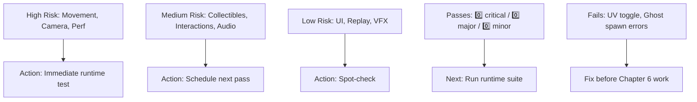

# Testing Summary

> **Note**: For December 10, 2025 specific test documentation, see: `docs/testing/2025-12-10-TESTING_SUMMARY.md`

---

# Testing Summary - Pre-Chapter 6

## Completed Fixes

### Code Quality Improvements
1. ✅ **Removed Test Cube**: Removed debug test cube from main.js
2. ✅ **Beat Detection Integration**: 
   - Imported BeatDetector class
   - Initialized beatDetector in initAudio()
   - Integrated beat detection into updateAudioAnalysis()
   - Beat detection now triggers worldStateReactor.reactToBeat()
3. ✅ **World State Reactor Integration**:
   - Initialized worldStateReactor with eventSystem and visualEffects
   - Added worldStateReactor.update() call in animation loop
   - World reactions now work on detected beats

### Previously Fixed Issues
1. ✅ Dash mechanic keybind (Shift+Space)
2. ✅ Camera mode keybinds (C, L, F)
3. ✅ Distance-based volume implementation
4. ✅ All initialization order issues resolved

## Current Status

### Systems Verified (Code Review)
- ✅ All imports are correct
- ✅ All systems are initialized
- ✅ No linting errors
- ✅ Dev server starts successfully
- ✅ Beat detection is integrated
- ✅ World state reactor is integrated

### Systems Needing Runtime Testing
The following systems need to be tested in the browser:

1. **Avatar Movement** (Priority: HIGH)
   - WASD movement
   - Running (Shift)
   - Crouching (Ctrl)
   - Hopping (Space)
   - Dashing (Shift+Space)
   - Dancing (Shift+D)
   - Sitting (E near seatable)

2. **Camera Controls** (Priority: HIGH)
   - Mouse orbit
   - Scroll zoom
   - Camera presets (1, 2, 3)
   - Camera snap (R)
   - Cinematic mode (C)
   - Lock-on mode (L)
   - Freecam (F)

3. **Collectibles** (Priority: MEDIUM)
   - Drips collection
   - Bubbles popping
   - Fragments collection
   - Glow balls effects

4. **Interactive Objects** (Priority: MEDIUM)
   - Doors
   - Teleporters
   - Fog vents
   - Seatable objects
   - Moving platforms
   - Ventilation fans
   - Interactive screens
   - Camera console
   - Lighting console
   - Portal rifts
   - Pushable props
   - Throwable drips

5. **UI Systems** (Priority: MEDIUM)
   - Emote wheel (Tab)
   - Fragment progress bar
   - Interaction reticle

6. **Audio Systems** (Priority: MEDIUM)
   - Footstep sounds
   - Distance-based volume
   - Beat detection (now integrated)

7. **Visual Effects** (Priority: LOW)
   - Event system (blackout, strobe, wave)
   - Visual effects (distortion rings, lasers, etc.)
   - Audio-reactive lighting

8. **Replay & Teleport** (Priority: LOW)
   - Replay recording (T)
   - Ghost spawning (G)
   - Teleport (Y)

9. **Performance** (Priority: HIGH)
   - FPS monitoring
   - Memory leak detection
   - Console error checking

## Next Steps

1. **Runtime Testing**: Test all systems in browser
2. **Bug Fixing**: Fix any issues found during testing
3. **Documentation**: Update TESTING_REPORT.md with findings
4. **Continue Chapter 6**: Proceed with remaining Chapter 6 features after testing

## Testing Plan

See `TESTING_PLAN.md` for detailed testing checklist.

## Notes

- Dev server is running at http://localhost:5173/
- All code changes have been committed
- No linting errors
- All systems appear to be properly integrated
- Ready for comprehensive runtime testing
